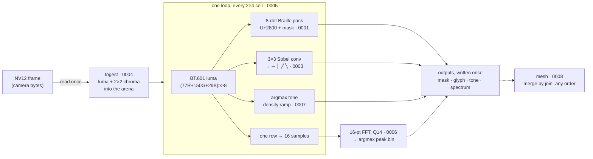
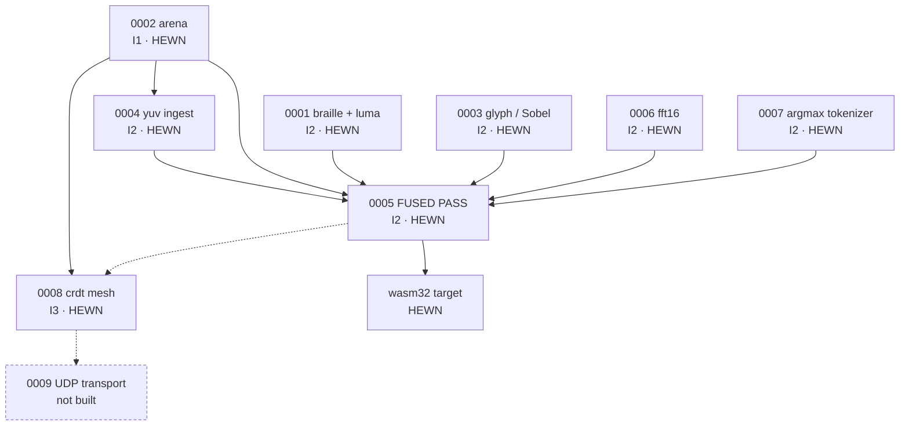

# Syzygy

[](https://github.com/SuperInstance/Syzygy/actions/workflows/ci.yml)
&nbsp;**[Run it in your browser →](https://syzygy-1j5.pages.dev/)**

**Syzygy turns a camera frame into text you can read (Braille dots, line drawings and a small frequency spectrum) in a single pass, using only integer arithmetic, so every machine that runs it gets exactly the same bytes.**

<!-- HERO: hermit-crab cross-section (VISUAL-IDENTITY-SEED) -->

It is under a thousand lines of C spread over eight header files. It never allocates memory, never touches floating point and never calls the C library, so the same source runs on a desktop, in a browser tab as a 6.8 KB WebAssembly module, and compiles for microcontrollers down to an 8-bit AVR. Because the arithmetic is exact, a result can be checked by anyone, anywhere, by comparing one number.

---

## Contents

- [Try it in thirty seconds](#try-it-in-thirty-seconds)
- [What Syzygy is](#what-syzygy-is)
- [What that makes possible](#what-that-makes-possible)
- [How the pass works](#how-the-pass-works)
- [The three promises](#the-three-promises)
- [Same bytes everywhere: the receipts](#same-bytes-everywhere-the-receipts)
- [The shard map](#the-shard-map)
- [How it was built](#how-it-was-built)
- [What is not true yet](#what-is-not-true-yet)
- [Run everything yourself](#run-everything-yourself)
- [Read further](#read-further)
- [Repository layout](#repository-layout)
- [Lineage and license](#lineage-and-license)

---

## Try it in thirty seconds

**In a browser:** open **[syzygy-1j5.pages.dev](https://syzygy-1j5.pages.dev/)**. The page runs the pass on a moving test pattern (or your camera, if you allow it) twice per frame: once as the **C kernel compiled to WebAssembly** and once as an **independent JavaScript port**. It counts how many frames came out byte-identical. The minimal original demo is at [`/poc/`](https://syzygy-1j5.pages.dev/poc/). Nothing leaves your device, including camera frames.

**On your machine:** any C11 compiler, nothing else.

```sh
git clone https://github.com/SuperInstance/Syzygy && cd Syzygy
sh tools/suite-total.sh
```

The last line should read:

```
=== TOTAL: 7 suites, 219 checks, 0 failures (run.sh exit 0) ===
```

Somewhere above it you will see the number that everything else in this README leans on:

```
  info: golden fnv1a = 0x6dbdd1a8
```

That is a hash of everything the pass produced for a fixed 32×16 test frame. Your compiler, your CPU and your optimisation level should all give you exactly this value.

---

## What Syzygy is

Start with a single frame from a camera: a grid of pixels, each with a brightness and a colour. Syzygy walks over that grid in blocks of **2 pixels wide by 4 pixels tall**. That block size is not arbitrary. It is exactly the dot layout of an 8-dot Braille character, and Unicode has a character for every one of the 256 possible dot patterns (`U+2800` to `U+28FF`). So each block becomes one character that you can print in a terminal, send over a serial line, or feel on a refreshable Braille display.

For every block, the pass works out four things at once:

- **Brightness**, using the broadcast-standard weights for how bright red, green and blue look to a human eye (ITU-R BT.601), done in integers: `(77·R + 150·G + 29·B) >> 8`. The weights add up to 256, so the shift divides exactly.
- **Braille dots**: each of the 8 pixels becomes a raised dot if it is brighter than a threshold.
- **An edge glyph**: a 3×3 Sobel convolution measures which way brightness is changing, and the block becomes `─`, `│`, `╱` or `╲` if it sits on an edge, or a shading character if it does not. The angle is decided with integer comparisons, with no trigonometry and no square roots.
- **A tone character**: a density character from ` .:-=+*#%@` chosen by picking the highest score (an argmax), with no probabilities or exponentials involved.

Along one chosen row, it also collects 16 blocks' worth of brightness and runs a **16-point Fourier transform** in fixed-point arithmetic. That tells you whether the row is dominated by slow change or fine repeating detail, and which frequency is strongest.

All of that happens in **one loop**. Each output byte is written once. The memory it needs is borrowed from a buffer you hand it, and given back exactly as it was found.

The name: a *syzygy* is when separate bodies fall into a single line, like the sun, moon and earth during an eclipse. Here the spatial work (edges), the spectral work (the FFT) and the symbolic work (characters) line up in a single pass over the same bytes.

> **Syzygy measures; it does not judge.** It produces the numbers a separate verification layer can reason about. Deciding what those numbers *mean* is deliberately somebody else's job. ([ARCHITECTURE.md](docs/marks/ARCHITECTURE.md), "What Syzygy is")

---

## What that makes possible

Every property below comes from a number measured in this repository. Each number is here for the use it enables.

| because… | …you can |
|---|---|
| the 32×16 test frame hashes to `0x6dbdd1a8` on gcc and clang at every optimisation level, on WebAssembly, and in a separate JavaScript port | **check someone else's result with one number.** Two devices that report the same hash saw the same thing, and a stranger can re-run it to confirm. |
| the headers compile freestanding, with no libc symbols, for Cortex-M4, Cortex-M0+, RISC-V 32, big-endian AArch64, AVR and MSP430, in 1.5 to 4.8 KB of code | **put it on a microcontroller**, next to the sensor, with no operating system. |
| the WebAssembly build is 6,808 bytes and imports nothing | **run it in any browser tab or embedded wasm runtime** with no runtime library to ship. |
| on the machine that built this README, a 160×96 frame took about 0.1 ms in the browser, under 1% of the 16.7 ms a 60 Hz screen allows per frame | **keep up with a live camera on an ordinary device, locally**, with no round trip to a server. The landing page measures this on *your* device. |
| memory use is constant: the arena's high-water mark does not move over 50 further frames | **size a static buffer once, at build time**, and never run out mid-stream. |
| cell grids merge the same way in any order, even with duplicates (6 replicas × 200 random delivery orders, identical every time) | **let devices share a picture over a lossy link with no coordinator** deciding who is right. |

---

## How the pass works


The same flow as text, for readers without images:



The numbers in the boxes are **shard ids**: each is one header in [`include/`](include/) and one test in [`tests/`](tests/). The stage-by-stage walkthrough, with the actual code and every shortcut it takes, is **[docs/the-fused-pass.md](docs/the-fused-pass.md)**.

A few words about the vocabulary:

- **NV12** is the format most cameras and video decoders hand you: a full-resolution brightness plane followed by a half-resolution colour plane.
- **Q14 fixed point** means a fraction is stored as an integer scaled by 2¹⁴ = 16384. `sin(45°)` becomes `11585`. Multiply, then shift right by 14, and you are back in whole numbers, with the same rounding on every machine.
- **Argmax** means "pick the index of the biggest value". Syzygy uses it wherever a neural network would use softmax, because it needs no exponentials and gives the same answer everywhere.

---

## The three promises

Every design decision in Syzygy reduces to one of three invariants. Each has a test that fails if it is broken.

**I1: no allocation.** The kernel only ever bumps a pointer inside a buffer you give it, marks where it started, and rolls back when the frame is done, whether it succeeded or failed. No `malloc`, no `free`. That is why it can run where there is no heap, and why its entire state can be dumped and read byte by byte.

**I2: integer-only, fused.** All arithmetic is integer, with fixed shifts, so the answer cannot depend on the CPU or compiler. And the stages run in one loop, not one pass each; a test proves the single loop produces exactly the same bytes as running the stages separately.

**I3: merge without consensus.** Cell grids from different devices combine with a *join*: an operation that gives the same result regardless of order, grouping or repetition. So there is nothing to coordinate.

Each promise is laid out with its mechanism, its tests and its known gaps in **[docs/invariants.md](docs/invariants.md)**.

---

## Same bytes everywhere: the receipts

"Byte-exact" is a claim that is easy to make and hard to earn, so here is exactly what has been checked, and what it lets you rely on:

| implementation | how it was checked | result | what it means |
|---|---|---|---|
| native C, gcc 13 and clang 18, `-O0` / `-O2` / `-O3` | `tests/test_fused.c` | `0x6dbdd1a8` every time; full-output hash `0x463de14b` | the optimiser cannot change your answer |
| C compiled to **wasm32** (no emscripten, no libc) | [`wasm/run.mjs`](wasm/MARK.md) | `0x6dbdd1a8`; equal to the JS port on 45/45 frames | the browser build can be trusted like the native one |
| hand-written **JavaScript** port | [V02 drift differ](docs/marks/V02-wasm-native-drift-differ.md) | byte-exact vs native C on 2,405 seeded frames | a second, independent implementation agrees |
| six **microcontroller / foreign ABIs** | [`tools/port-probe/cross.sh`](tools/port-probe/) | compile freestanding, no libc symbols | ready to run on a board; see [porting](docs/porting.md) |
| live frames **in your browser** | [landing page](https://syzygy-1j5.pages.dev/) | wasm == JS on every frame shown (150/150 in headless Chromium) | you can check it yourself, on your device |

And the tests are themselves tested. A **mutation gauge** ([V01](docs/marks/V01-kernel-oracle-mutant-gauge.md)) plants 42 realistic bugs, one at a time, and confirms that the suite catches every one that can be caught (41/41; one is provably harmless). When it was first run it found six gaps, and `test_fused.c` grew from 43 to 61 checks to close them. How all of this fits together is in **[docs/verifying.md](docs/verifying.md)**.

CI ([`.github/workflows/ci.yml`](.github/workflows/ci.yml)) re-runs every row of this table on every push.

---

## The shard map



| shard | header | what it does | test | checks |
|---|---|---|---|---|
| 0001 | [`syz_braille.h`](include/syz_braille.h) | BT.601 integer luma; 2×4 block → Braille mask → UTF-8 | `test_braille.c` | 31 (with 0003) |
| 0002 | [`syz_arena.h`](include/syz_arena.h) | bump-pointer arena, mark/rollback, overflow-safe | `test_arena.c` | 29 |
| 0003 | [`syz_glyph.h`](include/syz_glyph.h) | integer Sobel → `─ │ ╱ ╲` or shading ramp | `test_braille.c` | (shared) |
| 0004 | [`syz_yuv.h`](include/syz_yuv.h) | NV12 → luma, chroma, per-cell RGB, in the arena | `test_yuv.c` | 31 |
| 0005 | [`syz_fused.h`](include/syz_fused.h) | **the single pass**; fused == composed | `test_fused.c` | 61 |
| 0006 | [`syz_fft.h`](include/syz_fft.h) | 16-point radix-2 FFT, Q14; ≤ 2 LSB from a double-precision DFT | `test_fft.c` | 15 |
| 0007 | [`syz_ste.h`](include/syz_ste.h) | straight-through argmax over a fixed 4×4 basis | `test_ste.c` | 24 |
| 0008 | [`syz_crdt.h`](include/syz_crdt.h) | join-semilattice cells + Lamport clocks | `test_crdt.c` | 28 |
| | | | **total** | **219** |

**HEWN** means *a test in this repository proves it right now*. It is one of four marks the project uses; the next section explains them.

---

## How it was built

Syzygy was not designed in one sitting. It was grown from a 9,535-line **seed document** ([`docs/seed/blob.md`](docs/seed/blob.md)): three README drafts plus copy-paste code that contradicts itself in places, and that is kept, unedited, as the charter. A rotating crew of builders (people and agents who share no memory) turned it into working shards by reading and leaving **marks**:

| mark | means | what the next builder does |
|---|---|---|
| **HEWN** | cut and proven by a passing test | build on it |
| **SHAPED** | code exists, not yet tested | prove it |
| **DRAWN** | chalked out, no code yet | build it when its assumptions hold |
| **SCARF** | the seed contradicts itself here; both sides cited, one ruling made | read the ruling before crossing |

Every shard's mark states what it is, what runs, what **shortcut** it takes (a HEWN shard that admits none is not trusted), and what would make it better. Every promotion is appended to [`docs/marks/ledger.csv`](docs/marks/ledger.csv). Read that file from top to bottom and you can replay the project's reasoning without anyone to ask.

Some of what that caught: the seed's FFT rotated the wrong way (SCARF-7), its "production" header did not compile (SCARF-3), and one draft had the brightness formula at the wrong scale (SCARF-4). Each would have silently broken the golden hash.

The method, written as a blueprint you can reuse: **[docs/diffuse-by-marks.md](docs/diffuse-by-marks.md)**. The seed resolved into one architecture, with every contradiction: **[docs/marks/ARCHITECTURE.md](docs/marks/ARCHITECTURE.md)**. The mark vocabulary: [docs/marks/MARKS.md](docs/marks/MARKS.md).

---

## What is not true yet

This project writes down its gaps next to its claims. The current ones:

- **No microcontroller has actually run it yet.** Six targets compile clean; the golden hash has been produced on x86-64, wasm32 and in JavaScript only. [docs/porting.md](docs/porting.md) is the checklist for the first board.
- **"Register-resident" is the loop's shape, not a measured fact.** Tests prove the fused loop is *correct*; proving values stay in registers needs a disassembly or perf-counter witness.
- **The seed's 3×3 smoothing convolution is not in the loop.** The only 3×3 convolution the pass runs is the Sobel that picks edge glyphs.
- **The tokenizer is not learnable.** 0007 is a fixed argmax over a fixed basis; there is no training harness.
- **The mesh has no network yet.** 0008's merge is proven in memory; the UDP transport (0009) is unbuilt.
- **The seed's performance table is a claim, not a measurement.** `bench/` is DRAWN; the only timing in this README is the one the landing page measures on your device.

---

## Run everything yourself

```sh
sh tools/suite-total.sh                  # 219 checks, C11 compiler only
CC=clang sh tools/suite-total.sh         # same, with clang

sh wasm/build.sh && node wasm/run.mjs    # C → wasm32, golden + wasm == JS (clang, node ≥ 18)
node tools/wasm-native-drift-differ/differ.mjs          # native C vs JS port, 2405 frames
node tools/kernel-oracle-mutant-gauge/gauge.mjs --verify --strict   # 42 planted bugs (~35 s)
sh tools/port-probe/cross.sh             # freestanding compile for six MCU targets
sh tools/seed-guard.sh                   # the seed of record has not moved

cd docs && python3 -m http.server        # landing page at http://localhost:8000/
```

Using the kernel from your own C code takes one call:

```c
#include "syz_fused.h"

static uint8_t y[32*16], uv[32*8], pool[16384], mask[64], tone[64];
static uint32_t glyph[64];

SyzArena a;  syz_arena_init(&a, pool, sizeof pool);
syz_yuv_synth(y, uv, 32, 16, 32, 32);                    /* or your camera's NV12 */
SyzNv12 f = { .y = y, .uv = uv, .w = 32, .h = 16, .y_stride = 32, .uv_stride = 32 };
SyzFusedParams p = { .braille_thresh = 100, .edge_thresh2 = 4000, .fft_row = 1 };
SyzFusedOut o = { .cap = 64, .mask = mask, .glyph = glyph, .tone = tone };
int rc = syz_fused(&a, &f, &p, &o);   /* 0 ok, -1 bad input or buffer too small */
/* o.cols × o.rows cells; print U+2800 + mask[i]; o.spec_re/im[16]; o.peak_bin */
```

Want to contribute? Start with **[CONTRIBUTING.md](CONTRIBUTING.md)**.

---

## Read further

The README is the general introduction. Each deep-dive below is written for two readers, a newcomer and someone about to change the code, and follows the same shape: one breath, why, mental model, walkthrough with real output, contract, scars, how it composes, what's next.

| read this | if you want |
|---|---|
| **[Understanding Syzygy](docs/understanding-syzygy.md)** | the front door: every noun, the invariants, the contract |
| **[The fused pass](docs/the-fused-pass.md)** | each stage of the loop, with its code and shortcuts |
| **[The three invariants](docs/invariants.md)** | I1 / I2 / I3, the mechanism and the test behind each |
| **[Porting to new hardware](docs/porting.md)** | to bring the kernel up on a board and prove it with one hash |
| **[How the claims are checked](docs/verifying.md)** | the mutation gauge, the drift differ and why tests need testing |
| **[Diffuse by marks](docs/diffuse-by-marks.md)** | the method: building from a contradictory seed with no shared memory |
| **[Architecture & scars](docs/marks/ARCHITECTURE.md)** | the seed resolved into one design; SCARF-1 to SCARF-7 |
| **[Learning to project a feed](docs/ml-projection-landscape.md)** | the ML plugin layer beside the kernel: a vision model scores how much of a scene survives the text, and a search improves the projector |
| **[Live demo](https://syzygy-1j5.pages.dev/)** · [source](docs/index.html) · [minimal POC](docs/poc/) | to watch it run and check it on your own device |

---

## Repository layout

```
Syzygy/
├── README.md                 you are here
├── CONTRIBUTING.md           rules, and the one step people forget
├── include/                  the kernel: eight freestanding headers, syz_*.h
├── tests/                    one C test per shard + run.sh (219 checks)
├── wasm/                     wasm32 export bridge, build.sh, run.mjs
├── tools/
│   ├── suite-total.sh        runs tests/run.sh and prints the total
│   ├── seed-guard.sh         fails if the seed of record changes
│   ├── port-probe/           one-file golden probe + MCU cross-compile
│   ├── kernel-oracle-mutant-gauge/   V01: 42 planted bugs vs the suite
│   └── wasm-native-drift-differ/     V02: native C vs JS port
├── docs/
│   ├── index.html            the landing page (GitHub Pages / Cloudflare Pages root)
│   ├── poc/                  JS port, the served syzygy.wasm, minimal demo
│   ├── img/fused-pass.svg    the diagram above
│   ├── *.md                  the deep-dives linked above
│   ├── marks/                MARKS.md, ARCHITECTURE.md, ledger.csv, one mark per shard
│   └── seed/blob.md          the seed of record (never edited)
├── plugins/ml/               ML projection plugins beside the kernel (Node; network; not freestanding)
├── src/  bench/              DRAWN: native orchestrator, timing harness (MARK.md in each)
└── .github/workflows/ci.yml  the green gate
```

Directories with no code yet carry a `MARK.md` saying what will go there and what it waits on, so nothing is an empty stub.

---

## Lineage and license

- **[Chiaroscuro](https://github.com/SuperInstance/chiaroscuro)**, the predecessor: a multi-engine text-art renderer that asked "when a pixel becomes a character, what should the character know?" Syzygy fuses the stages that drew that line and points them at *signal → state*.
- **Syzygy**, this repository: the fused single-pass kernel.
- A separate **trust plane** wraps Syzygy's outputs in verdicts. Syzygy fills only the *measured* field (seed blob:408-433).

MIT licensed. See [`LICENSE`](LICENSE).

*"The evidence was always there. Syzygy is how you hold up the slides."* (seed, blob:226)
