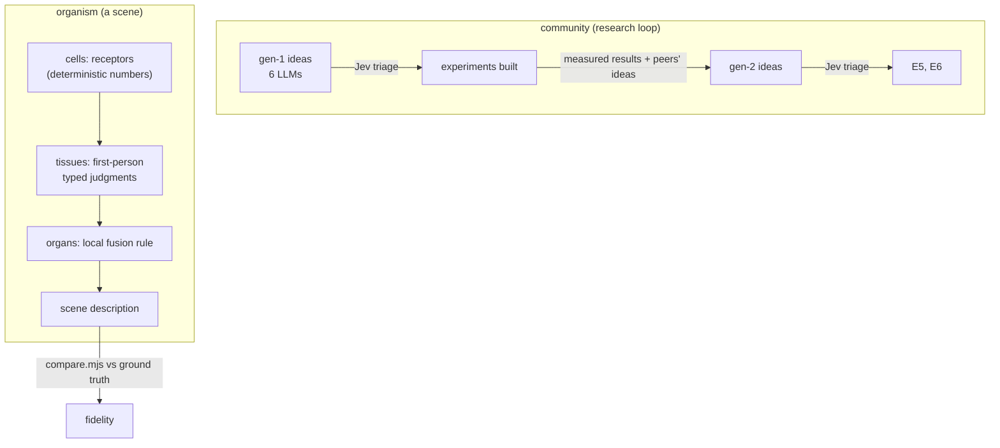

# Holarchic learning: many small typed perspectives instead of one big judge

*Deep-dive. Written for two readers: a **newcomer** asking "can learning be organised like cells, tissues and communities rather than like one trained network?", and a **practitioner** who wants to run, extend or refute the experiments. It builds on [Learning to project a feed into text](ml-projection-landscape.md). Code: [`plugins/ml/holarchy/`](../plugins/ml/holarchy/). Raw model replies: [`plugins/ml/logs/`](../plugins/ml/logs/), cached in [`plugins/ml/cache/`](../plugins/ml/cache/), so every number replays with `SYZ_ML_OFFLINE=1`.*

**Marks, as in the companion doc:** **[built]** means run and measured; **[confirmed]** means a causal test held. **[refuted]** means built, measured, and the hypothesis failed. **[proposed]** means not built. Every difference quoted as real has a paired-bootstrap 95% interval that excludes zero (`holarchy/stats.mjs`); anything else is called a tie.

## 1. In one breath

A research community of six language models proposed experiments. A typed "system-one" model (TypeSafe's Jev) triaged the ideas, and five experiments were built in which **many cheap, first-person, typed judgments stand in for one expensive judge**, organised as cells → tissues → organs → organism → community. The main measured lesson concerns *how* perspectives should combine, and when:

- **Consensus** among perspectives repairs **substitution** errors (members that say wrong things).
- **Union** repairs **omission** errors (members that miss things).
- **Gossiping beliefs spreads errors; gossiping choices coordinates.**
- **Momentary agreement is not enough to tell which regime you are in.** A holarchy needs to know its members' track record.

The last point was then tested causally. Injecting omissions into the *same* members' real outputs flips the winning rule from consensus to union, and a selector that only knows each member's claim rate from a few calibration cases picks the right rule every time (§4.9).

## 2. Why it exists

The projection work (companion doc) measured whether a picture survives being turned into text, using one expensive judge: a vision-language model. That is the classic shape of machine learning, one global loss handed down by one global critic. The question here is whether learning and judging can instead be **grown from many local viewpoints that cooperate without a centre**, the way cells form tissues and people form communities, and whether that can be *measured* rather than only described.

Two new kinds of tool make this testable today:

- **TypeSafe Jev** answers *typed* questions (a yes/no probability, a choice among named options, or an expected score on a rubric) about any text or JSON state in about 150–200 ms. Dozens of questions ride in one request (nine questions returned in 161 ms, faster than one question at 373 ms). That makes a *judgment* cheap enough to act like a nerve impulse rather than a deliberation.
- **Ground truth.** Every feed here is drawn, so every perspective, and every way of combining perspectives, can be scored against what was really there.

## 3. The mental model



- **Cells** transduce, they don't judge. A character becomes numbers: ink, edge orientation, arrow, trail. Deterministic and free.
- **Tissues** are first-person agents. *"I am the top-left tissue; this is what my cells report; what occupies me?"* Each answers typed questions. All tissues of one frame share **one** Jev request.
- **Organs** form by a *local* rule (adjacent tissues that claim the same thing fuse) and are never assigned from above.
- **The organism** is the resulting scene description, in the same schema the VLM critic emits, so both are scored identically.
- **The community** is the research loop itself: models propose, a typed judge triages, experiments report back, and the next round reads the evidence and each other's ideas.

## 4. Walkthrough with real output

### 4.1 The community ideates, and a typed judge triages [built]

`node plugins/ml/holarchy/ideate.mjs`. Six models were each asked for four concrete, falsifiable experiments using exactly these tools: Kimi-K2.6, Qwen3-235B, gpt-oss-120b and MiniMax-M3 via DeepInfra, plus DeepSeek and ZAI. Five delivered 20 ideas; Qwen's reply degenerated into garbage mid-JSON. Jev scored every idea on four typed questions (novelty, leverage and decentralisation as rubric scores; "testable this week" as a yes-probability). The top of the ranking:

```
0.548  [MiniMax-M3]  Community Jury: Distributed VLM Critics as Organs
0.543  [deepseek]    Jev-Negotiated Glyph Merger (Tissue Voting)
0.542  [Kimi-K2.6]   Tissue Consensus Voting
0.501  [MiniMax-M3]  Murmuration of Motion Arrows: Stigmergetic Guided Growth
0.494  [deepseek]    Perspective Tournament without a Center
```

A pattern across many ideas: they assumed Jev can *see* the frame. It can't; it reads text or JSON. That constraint shaped E1–E3, where receptors turn pixels or characters into numbers Jev can read.

### 4.2 E1: a holarchic reader with no vision model [built]

`holarchy/reader.mjs`, `e1-reader.mjs`. A 6 × 3 grid of tissues reads a text projection, first alone and then after hearing its four neighbours' claims. Tissues sense in one of two ways: their raw text patch, or their cells' receptor numbers. Scored against truth over 4 projectors × 10 feeds (160 Jev requests):

| projector | VLM reading the same text | best swarm reading (alone) | swarm after hearing neighbours |
|---|---|---|---|
| mirror (brightness) | 0.280 | **0.301** (raw) | 0.254 |
| syzygy tangent edges | 0.506 | 0.242 (receptors) | 0.235 |
| motion arrows over edges | 0.488 | 0.305 (receptors), motion recall 0.40 | 0.274 |
| braille | 0.362 | 0.225 (raw) | 0.225 |

The **abstraction profile** (receptor sense, edge projections) shows where the information dies:

- **tissue says "background" correctly:** 0.87–1.00. Fine.
- **tissue names the object it holds:** 0.10–0.24. **Information dies here.**
- **organ assembly** from correct tissues: the local rule works when it is fed correct tissues.
- **motion** read from arrows: recall 0.40. Survives.
- **setting** (indoor / day / night): 0.7 on tone projections, 0.2 on edge projections, where brightness per row no longer means brightness.

**Findings.**

1. The swarm matches the VLM on the brightness mirror but reaches only about 60% of it on edge projections (the VLM's lead there is +0.18, CI [0.10, 0.26]).
2. Hearing neighbours made object tissues more often right (0.10 → 0.24) and background tissues more often wrong (0.87 → 0.63): **object labels spread into empty sky like contagion**. The net fidelity change is slightly negative, not significant.

### 4.3 E2: a community jury instead of an average [built]

`e2-jury.mjs`. Three VLM critics (Qwen3-VL-30B, Gemma-3-27B, Mistral-Small-3.2) each reconstructed every run-3 finalist on every test feed: 36 cases, all cached. Who should be believed?

| rule | fidelity vs truth | vs average |
|---|---|---|
| average of the three (what run 3 did) | 0.301 | — |
| **peer consensus:** believe the reconstruction the other two agree with most (no judge, no centre, no API call) | **0.354** | **+0.053, CI [0.016, 0.089]** |
| Jev as judge (sees the three reconstructions, never the truth) | 0.343 | +0.042, CI [0.006, 0.078] |
| Jev as judge + the peer-agreement numbers | 0.346 | +0.045 |
| oracle: best of three against truth | 0.433 | — |

Leaderless agreement closes 40% of the gap between averaging and the oracle, for free. Peer consensus and the Jev judge can't be separated (CI of the difference [−0.026, 0.046]).

### 4.4 E3: guided growth, tissues choose how to draw themselves [built]

`e3-growth.mjs`. An 8 × 4 grid of tissues each *senses its own patch of the real frame* as numbers (brightness, texture, edge energy and direction, motion energy). Each chooses a drawing style (tone, edges, braille or motion arrows), then hears its neighbours' **choices** and chooses again. The text is the resulting mosaic. Scored by the 3-VLM ensemble on 10 feeds:

| projection | vs VLM reference | motion recall |
|---|---|---|
| tissues choose alone (round 1) | 0.262 | 0.04 |
| **after hearing neighbours' choices (round 2)** | **0.328** (+0.066, CI [0.002, 0.128]) | 0.00 |
| hand-written rule on the same numbers | 0.311 | 0.22 |
| random mosaic | 0.262 | 0.22 |
| uniform tangent edges | 0.350 | 0.11 |
| uniform motion-over-edges | 0.347 | 0.31 |

The street scene grown in round 2 (letters: the style each tissue chose):

```
e t e e t t t t
t e e e t t e e
e e e e e e e e
t t t t m e e t
```

**Findings.**

1. Negotiation helped here, where in E1 it hurt. The difference is the *content* of the message: a neighbour's **choice** (coordinate your style with mine) against a neighbour's **belief** (there is a building here).
2. The grown mosaic ties uniform edges (n.s.) but doesn't beat it: mixing styles cuts objects at tissue seams, and a reader wants a consistent code.
3. Jev chose the motion style for 6 of 320 tissues even when the motion sense fired, so it under-values the one channel that carries time.

### 4.5 E4: the kaleidoscope rule [built; my hypothesis refuted]

`e4-kaleidoscope.mjs`, 0 new API calls. Each E1 tissue had two independent weak senses. Hypothesis (from E2): *trust only what both senses agree on*.

| rule | fidelity | background kept |
|---|---|---|
| receptors alone | 0.189 | 0.933 |
| raw text alone | 0.233 | 0.997 |
| **both must agree** | **0.100** | 1.000 |
| both agree, or neighbours with agreeing senses support it | 0.099 | 0.995 |
| **union: either sense** | **0.278** | 0.931 |

Requiring agreement collapsed recall: the senses err in different places and rarely coincide on an object. The **union** beats the better sense (+0.046, CI [0.019, 0.076]) and ties an oracle that knows, per reading, which sense to trust (p = 0.69).

### 4.6 Generation 2: the community reads the evidence [built]

`ideate2.mjs`, `diversity.mjs`. Every model received E1–E4's measured results *and* the whole generation-1 idea pool, from all models, with no editor, and proposed three higher-level experiments. Five delivered 15 ideas; Kimi timed out on the longer prompt. Both generations were then judged by Jev on one yardstick with the evidence in view:

| | gen 1 (20) | gen 2 (15) |
|---|---|---|
| builds on the measured evidence (yes-probability) | 0.70 | **0.97** |
| leverage (0–4) | 2.71 | **3.18** |
| novelty (0–4) | 2.29 | 2.36 |
| decentralisation (0–4) | 2.58 | 2.36 |
| merit (aggregate) | 0.464 | 0.468 |
| diversity: mean pairwise cosine distance of idea embeddings (Qwen3-Embedding) | 0.451 | 0.438 |

Shared evidence made the community's ideas grounded and more ambitious, not more novel, and it concentrated them: 6 of 15 gen-2 ideas were variants of one theme, a **regime selector** that decides between consensus and union. Diversity fell by only 3%, so this is concentration, not collapse. The top gen-2 ideas: "Holarchic Research Loop: Tissues That Propose Their Own Experiments" (DeepSeek), "Autocatalytic Tissue Specialization" (Qwen3-235B), "Regime-Switching Holarchy" (MiniMax-M3).

### 4.7 E5: the regime selector the community converged on [built; refuted as specified]

`e5-regime.mjs`. Can a holarchy decide per case between consensus and union from how much its perspectives agree? It was tested on E2 (three VLM critics) and E4 (two Jev senses), with a threshold learned on one dataset transferred to the other, and with Jev deciding per case (76 typed choices).

| | E2 (VLM critics) | E4 (Jev senses) |
|---|---|---|
| mean agreement between members | 0.237 | 0.206 |
| fixed consensus / fixed union | **0.354** / 0.281 | 0.100 / **0.278** |
| threshold transferred from the other dataset | 0.285 (−0.068, CI [−0.113, −0.025]) | 0.100 (−0.178) |
| Jev chooses per case | 0.281 (chose union every time) | 0.278 (chose union every time) |
| oracle per case | 0.377 | 0.280 |

Agreement levels are nearly identical in two settings that need opposite rules, so **agreement can't be the regime signal**. Jev, told what the members were and how they agreed, picked union for every case.

### 4.8 E6: what does set the regime [built; supported, not proven]

`e6-errortype.mjs`, 0 new API calls. Precision, recall and claim rate per member, against truth:

| member | precision | recall | objects claimed / true |
|---|---|---|---|
| critic Qwen3-VL-30B | 0.445 | 0.333 | 3.11 / 3.50 (×0.89) |
| critic Gemma-3-27B | 0.245 | 0.113 | 2.17 / 3.50 (×0.62) |
| critic Mistral-Small-3.2 | 0.321 | 0.259 | 3.67 / 3.50 (×1.05) |
| Jev sense, receptors | 0.204 | 0.102 | 1.02 / 3.50 (**×0.29**) |
| Jev sense, raw text | 0.346 | 0.123 | 1.02 / 3.50 (**×0.29**) |

My first guess was that critics over-claim, so consensus fixes them. That was wrong too: they claim about the right *number* of objects (×0.62–1.05), but many claims are *wrong*. These are **substitution** errors. The Jev senses claim under a third of what is there. These are **omission** errors. So:

- **consensus repairs substitution:** independent wrong answers scatter, right answers coincide;
- **union repairs omission:** each member misses different things.

The variable that separates the regimes is the **claim ratio** (claims ÷ objects expected), and knowing the expected count needs a prior or a track record. E5's momentary agreement has neither. With two regimes observed, this was only *consistent with* the data, so E7 tested it by intervention.

### 4.9 E7: a causal test, and the track-record selector [built; confirmed]

`e7-intervention.mjs`, 0 new API calls. If error type *causes* the regime, then turning the VLM critics' errors into omissions (deleting each claimed object with probability p, seeded) must flip the winner from consensus to union, with the same members and the same scenes.

| omission injected | members' claim ratio | consensus | union | union − consensus, 95% CI |
|---|---|---|---|---|
| none (real critics) | ×0.85 | **0.354** | 0.281 | −0.072 [−0.117, −0.029] |
| 30% | ×0.50 | 0.199 | **0.300** | +0.101 [0.054, 0.148] |
| 50% | ×0.33 | 0.154 | **0.258** | +0.104 [0.067, 0.139] |
| 70% | ×0.21 | 0.115 | **0.196** | +0.082 [0.051, 0.113] |
| 85% | ×0.11 | 0.066 | **0.115** | +0.049 [0.024, 0.075] |

The flip happens as predicted, and every interval excludes zero. The crossover lies between claim ratios ×0.85 and ×0.50; these runs bracket it but don't locate it.

**Track-record selector.** Split the 36 cases in half. On the calibration half (truth known), measure the members' mean claim ratio; choose **union if it is below 0.5**, else consensus. The 0.5 was set from E6 before E7 ran. Apply the choice to the evaluation half:

```
p=0.00  calibration claim ratio x0.86 -> consensus  eval 0.408 (other rule 0.290)
p=0.30  calibration claim ratio x0.48 -> union      eval 0.305 (other rule 0.234)
p=0.50  calibration claim ratio x0.33 -> union      eval 0.296 (other rule 0.168)
p=0.70  calibration claim ratio x0.22 -> union      eval 0.226 (other rule 0.122)
p=0.85  calibration claim ratio x0.11 -> union      eval 0.133 (other rule 0.063)
```

It picks the winning rule at all five levels, and agrees with what calibrating directly on fidelity would pick, while needing only object *counts* on the calibration cases. E4's Jev senses (claim ratio ×0.29) fall on the union side too, where union won. This is the lever the E5 selector lacked: **a member's track record (how much it claims relative to what is there) says how to combine it; its momentary agreement does not.**

## 5. The contract

Every experiment uses the plugin layer's contract unchanged (`registry.mjs`: projectors, scorers, `compare.mjs`) and adds:

```js
import { readScene, organs, tissueTruth } from './plugins/ml/holarchy/reader.mjs';
const r = await readScene(text, { sense: 'receptors' | 'raw', rounds: 2 });
// r.objects, r.setting: a scene in the critic's schema; r.rounds[i].claims: per-tissue {what, conf, motion}
```

```js
import { systemOne, embed } from './plugins/ml/apis.mjs';
await systemOne(state, { q1: { type: 'choice', instructions, criteria: { a: '...', b: '...' } }, q2: { type: 'noul', instructions } });
await embed(['text', ...]);   // DeepInfra Qwen3-Embedding, cached
```

| file | what it measures | new API calls |
|---|---|---|
| `holarchy/ideate.mjs`, `ideate2.mjs` | community ideation + Jev triage, gen 1 and gen 2 | 6 LLMs + ~75 Jev |
| `holarchy/diversity.mjs` | idea diversity by embeddings | 2 embedding calls |
| `holarchy/e1-reader.mjs` | typed-swarm reader + abstraction profile | 160 Jev (≈5,800 typed questions) |
| `holarchy/e2-jury.mjs` | jury vs average | 68 Jev, 0 VLM |
| `holarchy/e3-growth.mjs` | guided growth by tissue choice | 20 Jev (640 choices) + 140 VLM |
| `holarchy/e4-kaleidoscope.mjs` | consensus vs union of senses | 0 |
| `holarchy/e5-regime.mjs` | agreement-based regime selector | 4 Jev (76 choices) |
| `holarchy/e6-errortype.mjs` | error type per member | 0 |
| `holarchy/e7-intervention.mjs` | causal omission sweep + track-record selector | 0 |
| `holarchy/stats.mjs` | paired bootstrap for every claimed difference | 0 |

In total: about 300 Jev requests carrying about 6,800 typed judgments (median 199 ms per request), about 150 new VLM calls (about $0.02), 14 LLM ideation calls and 2 embedding calls.

## 6. Failure modes (the scars)

- **Jev can't see.** Most first-round ideas assumed it could. Every design here goes through receptors (numbers) or text, and on raw character art Jev is weak at the "what" (object-tissue accuracy 0.03–0.24).
- **Gossip is contagion.** Passing *beliefs* between neighbours spread object labels into empty sky (E1). Passing *choices* coordinated (E3). A holarchy has to say which one a message is.
- **Consensus of weak members is silence.** Requiring agreement between two weak senses left only background (E4: 0.100).
- **A typed judge can have a default.** Jev chose "union" for all 76 regime cases, and the motion style for only 6 of 320 tissues. A single typed question can hide a strong prior. Balance the options' wording, and test the judge against a known answer before trusting it (§4.7 did; it failed).
- **Mosaics have seams.** Style-mixing cuts objects at tissue borders (E3). Readers want a consistent code.
- **Small n.** 10 feeds for E1, E3 and E4; 36 cases for E2. Every "real" difference here has a bootstrap CI excluding zero; several borderline ones (E3 negotiation, CI lower bound 0.002) should be re-run on more feeds.
- **Models fail in model-specific ways.** Qwen3-235B produced a corrupted reply mid-JSON in gen 1, and Kimi-K2.6 timed out on the long gen-2 prompt even with reasoning off. A community of models needs to tolerate members that don't answer.
- **Synthetic scenes.** Everything is measured on drawn scenes with ground truth. The principles may transfer; the numbers are specific.

## 7. How it composes

- **With the projection plugins:** E2's peer-consensus rule can replace the ensemble *average* as the critic inside `search.mjs`. It scored +0.053 closer to truth, at no extra cost. [proposed; a one-line change to `scorers/vlm.mjs`]
- **With the kernel:** cells as deterministic receptors are exactly what the byte-exact kernel is good at. The kernel could emit tissue-level receptor summaries (ink, edge orientation histogram, motion energy) with the same bytes on every device, leaving only the *judgments* to typed models. [proposed]
- **With the mesh (0008):** the kernel's join-semilattice merge is a *union*. E4 and E6 say union is the right merge exactly when members under-claim, which is the case for sparse, partial views from many small devices. [proposed]
- **With the research loop:** gen 1 → build → measure → gen 2 is itself a community-level holarchy, and Jev's typed triage let "did sharing evidence improve the community?" be answered with numbers (§4.6).

## 8. Where to look next

| idea | status | next step |
|---|---|---|
| Track-record regime selector | **[built]** E7 | 5/5 correct across an omission sweep. Next: per-member weights instead of one rule; a member mix of over- and under-claimers; locate the crossover between ×0.5 and ×0.85 |
| Peer-consensus critic inside the search | [proposed] | swap `critic_models` averaging for peer pick; re-run run 3's held-out promotion |
| Boundary-aware negotiation | [proposed], from E1's contagion | neighbours exchange *"is my edge continuous with yours?"* (a noul on receptor numbers) instead of labels; organs form where boundaries close |
| Motion-aware tissue choice | [proposed], from E3 | re-word the choice so time isn't the minority option, or hand the motion channel to a dedicated organ |
| Autocatalytic tissue specialisation | [proposed] (gen-2 #2, Qwen3-235B) | tissues that succeed recruit neighbours into their style; measure whether specialisation beats uniform edges |
| Research loop where tissues propose experiments | [proposed] (gen-2 #1, DeepSeek) | the lowest-accuracy level of the abstraction profile writes the next experiment's question |
| Generation 3 of the community | [proposed] | feed E5/E6 back; measure whether the refuted-idea evidence moves novelty (it didn't move in gen 2) |
| Many-feed replication of E3 and E4 | [proposed] | 30+ feeds to firm up the borderline intervals |

Run it yourself:

```sh
SYZ_ML_OFFLINE=1 node plugins/ml/holarchy/e2-jury.mjs          # replays from cache, 0 calls
SYZ_ML_OFFLINE=1 node plugins/ml/holarchy/e4-kaleidoscope.mjs
SYZ_ML_OFFLINE=1 node plugins/ml/holarchy/e6-errortype.mjs
node plugins/ml/holarchy/e7-intervention.mjs                   # sets offline itself
node plugins/ml/holarchy/stats.mjs                              # every CI quoted above
```
