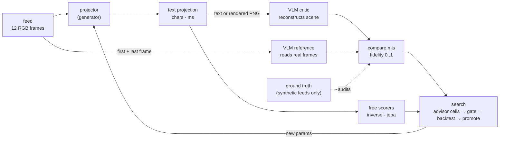

# Learning to project a feed into text

*Deep-dive. Written for two readers: a **newcomer** asking "can a machine judge whether character art shows what the camera saw?", and a **practitioner** who wants to add a projector, a scorer or an advisor to the plugin layer. Back to the [README](../README.md). The code is [`plugins/ml/`](../plugins/ml/) and its mark is [`plugins/ml/MARK.md`](../plugins/ml/MARK.md). Every number below comes from a run whose raw model replies are in [`plugins/ml/logs/`](../plugins/ml/logs/) and replay from [`plugins/ml/cache/`](../plugins/ml/cache/).*

**What is built and what is proposed.** Marked throughout as **[built]** (code in this branch, run, number measured), **[built, thin]** (runs, but the evidence is small: 4 scenes, one critic sample each) or **[proposed]** (described, not built).

## 1. In one breath

A projector turns a few seconds of camera frames into plain text. A vision-language model is then shown **only the text** and asked to reconstruct the scene as data: which objects, where, moving which way. A second reading of the **real frames** is the reference, and the agreement between the two readings is the projection's **fidelity**. The projector plays the generator and the vision model plays the critic, GAN-style, except that nothing is trained by gradient: a search proposes new projector settings and keeps the ones that score better per character and per millisecond.

## 2. Why it exists

Syzygy's kernel turns a frame into characters with the same bytes on every machine, and it deliberately *measures without judging*. Nothing in the kernel can tell you whether its characters show what the camera saw. Chiaroscuro, its predecessor, had a human-eye check for that, the **lake test**: put a new engine next to the honest brightness-only Mirror and look. That check doesn't scale, and it can't run inside a search loop.

This work makes the lake test a number, so that:

- two projectors can be compared on the same feed without a person looking;
- a projector's settings can be **searched** on the same three-way trade the rest of the fleet uses: fidelity (good), characters (cheap), compute (fast);
- "understanding a feed over time" gets an operational meaning. Motion is part of the scene description, and a projector that shows *what moved* can be rewarded for it.

## 3. The mental model



Four ideas carry the design:

1. **A scene description is the shared currency.** Critic, reference and ground truth all emit the same JSON: `setting`, and per object a `label`, a `category`, a 3×3 `region`, a normalized bounding `box` (a flat 2-D "wireframe") and a `moving` direction. `compare.mjs` pairs objects greedily and scores what matched, where it is and whether it moves the same way. It divides by the larger of the two object counts, so a critic that lists everything it can imagine is charged for it.
2. **Two references, reported side by side.** `vs_vlm` compares against a VLM's reading of the real frames. That is the mission's definition, and it works on a real camera with no labels. `vs_truth` compares against the generator's ground truth. That only works on synthetic feeds, but it **audits the critic itself**.
3. **Signals cost different amounts, so they cascade.** `inverse` is free and local: it reads the text back as ink and correlates that with brightness. `jepa` is cheap and local: a probe asks how well the text predicts the next frame. `vlm` is paid: one call per scene. A search spends the free ones first.
4. **The kernel measures, the plugins interpret.** The `syzygy` projector runs the shipped, byte-exact JS port unmodified. No plugin can change what the kernel emits, and the plugin selftest re-derives the golden `0x6dbdd1a8` from the very module the projector loads.

## 4. Walkthrough with real output

### 4.1 The feeds

There is no camera in a headless container, so [`scenes.mjs`](../plugins/ml/scenes.mjs) draws four 320×192 feeds of 12 frames each. Each has a background and 3–4 objects, one of them moving at a known velocity. Ground truth is rendered, not guessed: each object is drawn alone on a sentinel frame to get its exact box in the newest frame.

| feed | objects (truth) | moving |
|---|---|---|
| street | sun, house, tree, car | car → right |
| park | cloud, tree, person (stick figure) | person ← left |
| night | moon, two towers, car | car ← left |
| room | window, table, ball | ball → right |

### 4.2 The projectors, on the street feed (48 columns, 672 characters each)

**mirror** [built]: brightness only, ` .:-=+*#%@`. The lake-test reference.
```
************************************************
***************************************%%%%#****
**************************************#%%%%%#***
*********+-:=+*************************#####****
******+=::::::-=*******************+===+********
****+------------=****************-------+******
#####+++++++++##+*###############=--------######
#####+++++--=+%%**###############*-------+######
#####+++++..-++++*#################+=:=+*#######
+++++=====--=====+++++++++++++++++++=:=+++++++++
=================================-+**-==========
================================---------=======
================================-..-==: :=======
================================================
```

**syzygy** [built]: the fused kernel's per-cell glyph. Sobel edge glyphs on edges, the density ramp elsewhere. As the kernel ships it, `─`/`│` name the *gradient* axis (mark 0003), so the horizon reads `│││` and the frame's left border reads `─`:
```
─+++++++++++++++++++++++++++++++++++++++++++++++
─+++++++++++++++++++++++++++++++++++++╱╱###╲╲+++
─+++++++++++++++++++++++++++++++++++++─#####─+++
─++++++++╱╱│╲╲+++++++++++++++++++++++++╲╲#╱╱++++
─******╱╱:::::╲╲╲*******************││││********
─***╱╱:::::::::::╲╲***************╱:::::╲╲******
─****─========││╲─***************─:::::::──*****
─****─====│││=─│──***************╲╲::::::─╱*****
─****─====─.─====─*****************╲╲:╱╱╱*******
─│││││││││╲│╱│││││││││││││││││││││││╱──│││││││││
─================================─╱││╲╱=========
─===============================─:╲││::││─======
─===============================╲─ ─││─ ─╱======
─===============================================
```
With `orient: 'tangent'` [built] the plugin swaps only `─`↔`│`. The kernel's diagonals already lie along their edges, and the roof shows it. Now every glyph traces its edge: walls `│`, horizon `─`, the sun a ring. The kernel's bytes are untouched.

**syzygy, braille field** [built]: the kernel's 8-dot braille mask, one dot per pixel above threshold, so each character carries 2×4 pixels of shape.
```
⣿⣿⣿⣿⣿⣿⣿⣿⣿⠟⠋⠈⠙⢿⣿⣿⣿⣿⣿⣿⣿⣿⣿⣿⣿⣿⣿⣿⣿⣿⣿⣿⣿⣿⣿⣿⣿⣿⣿⣿⣿⣿⣿⣿⣿⣿⣿⣿
⣿⣿⣿⣿⣿⣿⡿⠋⠁⠀⠀⠀⠀⠀⠈⠻⢿⣿⣿⣿⣿⣿⣿⣿⣿⣿⣿⣿⣿⣿⣿⣿⣿⣿⣿⠿⠟⠛⠛⠿⣿⣿⣿⣿⣿⣿⣿⣿
⣿⣿⣿⣿⣟⣁⣀⣀⣀⣀⣀⣀⣀⣀⣀⣀⣀⣉⣻⣿⣿⣿⣿⣿⣿⣿⣿⣿⣿⣿⣿⣿⣿⡿⠁⠀⠀⠀⠀⠀⠈⢻⣿⣿⣿⣿⣿⣿
⣿⣿⣿⣿⣿⣿⣿⣿⣿⣿⣿⣿⣿⣿⣿⣿⣿⣿⣿⣿⣿⣿⣿⣿⣿⣿⣿⣿⣿⣿⣿⣿⣿⡇⠀⠀⠀⠀⠀⠀⠀⢸⣿⣿⣿⣿⣿⣿
⣿⣿⣿⣿⣿⣿⣿⣿⣿⣿⠛⠛⢻⣿⣿⣿⣿⣿⣿⣿⣿⣿⣿⣿⣿⣿⣿⣿⣿⣿⣿⣿⣿⣷⡀⠀⠀⠀⠀⠀⢀⣼⣿⣿⣿⣿⣿⣿
   … (rows 1–3 and 10–14 elided: solid ⣿)
```

**motion** [built]: the new projector, which shows *what moved*. Per cell it builds a temporal-median background over the last 12 frames, finds foreground blobs in the newest frame, and tracks them back through a 4-frame window by nearest centroid. It then redraws the scene with the blob's leading edge as direction arrows and a `~` trail where the blob just was:
```
… (rows 0–9 identical to mirror)
============================~~~~~~+*>-==========
==========================~~~~~~-------->=======
==========================~~~~~~~.>~~~: >=======
================================================
```
With `bg: 'edges'` [built], the same arrows and trail sit on the kernel's edge glyphs relabelled to lie along their edges. This is the best config on unseen feeds (§4.6):
```
│+++++++++++++++++++++++++++++++++++++++++++++++
│+++++++++++++++++++++++++++++++++++++╱╱###╲╲+++
│+++++++++++++++++++++++++++++++++++++│#####│+++
│++++++++╱╱─╲╲+++++++++++++++++++++++++╲╲#╱╱++++
│******╱╱:::::╲╲╲*******************────********
│***╱╱:::::::::::╲╲***************╱:::::╲╲******
│****│========──╲│***************│:::::::││*****
│****│====───=│─││***************╲╲::::::│╱*****
│****│====│.│====│*****************╲╲:╱╱╱*******
│─────────╲─╱───────────────────────╱││─────────
│===========================~~~~~~╱─>╲╱=========
│=========================~~~~~~│:╲──::─>│======
│=========================~~~~~~~│>~~~│ >╱======
│===============================================
```
House walls and roof, the sun's ring, the tree's crown, the horizon, and a car whose leading edge is `>` with a `~` wake.

Its tracker reads the car at **+2.77 cells/frame → right**. On all four feeds the tracker's direction matches the truth (selftest). On a feed where nothing moves, its output equals the mirror's byte for byte, so motion costs nothing when nothing moves.

### 4.3 The ceiling: the critic reading the real frames

Before scoring any text, the critic (Qwen3-VL-30B-A3B via DeepInfra) is shown the real first and last frames and compared with ground truth. That is the most any projection can hope to recover:

```
$ node plugins/ml/playtest.mjs --stage ceiling
=== ceiling: Qwen/Qwen3-VL-30B-A3B-Instruct reads the real frames, vs ground truth ===
  street fidelity 0.989  motion_recall 1
  park   fidelity 0.935  motion_recall 1
  night  fidelity 0.920  motion_recall 1
  room   fidelity 0.833  motion_recall 0
  MEAN ceiling 0.919
```

Two lessons came from getting here. First, the ceiling was 0.745 until `compare.mjs` learned that Qwen-VL writes boxes on a 0–1000 grid in some replies and 0–1 in others. Second, with a 3-frame gap the critic said the person and the ball were *not* moving. It needed the full 11-frame gap to see it.

### 4.4 The lake test, in numbers

Same four feeds, 1216 characters each (64 columns), critic Qwen3-VL-30B. **Text mode** puts the characters in the prompt; **image mode** renders them to a PNG (light monospace on black, cells 2:1) in headless Chromium, so the critic *sees* them the way a person at a terminal would.

| projector | vlm fidelity, text | vlm fidelity, image | vs truth, image | motion recall, image | jepa R² | inverse (tone) | chars |
|---|---|---|---|---|---|---|---|
| mirror | 0.068 | 0.322 | 0.325 | 0.33 | 0.000 | 0.929 | 1216 |
| mirror ×2 frames | 0.219 | 0.214 | 0.195 | 0.00 | 0.087 | 0.929 | 2432 |
| syzygy (glyph) | **0.306** | 0.282 | 0.308 | 0.00 | 0.000 | 0.631 | 1216 |
| syzygy (braille) | — | **0.500** | 0.501 | 0.00 | 0.000 | 0.761 | 1216 |
| motion (tone bg) | 0.224 | 0.248 | 0.233 | 0.33 | **0.195** | 0.905 | 1216 |
| motion (fused bg) | — | 0.287 | 0.331 | 0.00 | 0.195 | 0.631 | 1216 |
| syzygy (glyph, `orient: tangent`) | — | **0.551** | 0.573 | 0.00 | 0.000 | 0.631 | 1216 |
| motion (braille bg) | — | **0.667** | 0.741 | 0.67 | 0.195 | 0.748 | 1216 |
| **motion (`bg: edges` = tangent glyphs)** | — | **0.549** | 0.601 | **1.00** | 0.195 | 0.631 | 1216 |

The last three rows were added *after* the search in §4.6 and are the product of this loop. The held-out check in §4.6 tells which of them are real.

(Text-mode motion recall: mirror 0.00, motion **0.50**. The same five text-mode candidates with the larger Qwen3-VL-235B critic: mirror 0.110, mirror×2 0.085, syzygy 0.179, motion 0.146, motion+legend **0.304**.)

What the numbers say, and how far to trust them:

- **Every projection loses most of the scene.** The best baseline recovers 0.50 against a 0.92 ceiling. The gap is shared between the projector and the critic's ability to read character art, and these runs can't split it.
- **How the critic reads changes the ranking.** Shown text tokens, the edge-glyph projection wins (0.306) and the honest mirror almost vanishes (0.068). Shown a *picture* of the same text, the mirror jumps to 0.322 and braille reaches 0.500. A projector is only "good" relative to a reader, so the critic mode belongs in the config, not in the fine print.
- **The free tonal score points the wrong way.** `inverse` ranks the mirror first and the edge glyphs last, the reverse of the critic. A search that used tone as its objective would optimize away the edges that make the scene legible. The free scorer is still useful as a sanity floor (a shuffled mirror scores < 0.11), not as an objective.
- **Motion shows up in the right places.** The motion projector is the only one with a nonzero JEPA score (0.195–0.27: the text predicts *where the next frame will change*) and the best text-mode motion recall (0.50). The critic still misses motion more often than it catches it.
- **Relabelling two glyphs is worth +0.27.** The kernel's `─`/`│` name the gradient axis. Swapping them so every glyph lies *along* its edge takes the edge projection from 0.282 to 0.551 on these feeds, and from 0.245 to 0.494 on unseen ones (§4.6). The kernel's bytes are unchanged; only the reading changed.
- **Noise is large.** n = 4 scenes, one sample each. The same projector moves by ±0.15 between critic modes and models, and a one-line legend flipped a 235B score from 0.146 to 0.304. Treat single differences below ~0.1 as unresolved.

### 4.5 The JEPA-lite probe

[built, thin] For each projector config, a ridge probe is trained on 600 random synthetic feeds and tested on 150 others. It maps features of the text for frames 0..11 to a target computed from frame 12, which the projector never saw. No labels are involved: the feed supervises itself.

| target | mirror | mirror ×2 | syzygy | motion (tone) | motion (blank bg) |
|---|---|---|---|---|---|
| next-frame luma (16×8) | 0.983 | 0.983 | 0.973 | 0.930 | −2.37 |
| signed change (next − current) | ≤ 0.02 | ≤ 0.02 | ≤ 0.02 | < 0 | < 0 |
| **\|change\| — where it will change** | **−0.01** | **0.087** | **0.000** | **0.195** | **0.214** |

"Predict the next frame" is useless as a signal: every scene is mostly static, so any tone-preserving text scores about 0.98. The signed change can't be learned linearly, because a dark car on grass and a bright ball on a floor move the same way with deltas of opposite sign. *Where* the next change will happen is both learnable and discriminating. It is the one signal here that rewards understanding over time, and it costs no API call.

### 4.6 The evolving search, and the held-out check that tempers it

[built, thin] `search.mjs` runs generation 0 (every projector at its defaults), then each generation:

1. **Advisor cells propose.** `llm:deepseek`, `llm:kimi` and `llm:zai` each receive the typed schema, the utility formula and the scored history (numbers, plus what the critic *missed* and *invented* per scene), and return JSON proposals with a one-line rationale. `quantum` mutates one of the top-4 parents with 32 bytes from MothQuantum's QRNG. `local` performs the identical mutation driven by xorshift32, as the control arm.
2. **The gate filters** (§4.7).
3. **The cascade scores** the survivors: free `inverse`, cheap `jepa`, then the paid critic on all four feeds.
4. **Winners are promoted** by U = vlm + 0.25·jepa − 0.05·chars/1000 − 0.002·ms. The Pareto front over (vlm, chars, ms) is saved alongside, so anyone can re-rank with other weights. The ms term is measured wall time, so U wobbles by about 0.005 between runs of the same config.

**Run 1** (`node plugins/ml/playtest.mjs --stage all --gens 3 --per-cell 2`; image-mode critic; log in `plugins/ml/logs/playtest-image-run1.txt`):

```
g1 llm:deepseek #4  U=0.501 vlm=0.647 chars=2784 syzygy {"cols":96,"field":"braille",...}   | Braille field at higher cols may capture ...
g1 llm:kimi     ERROR 429 ... suspended due to insufficient balance ...
g1 llm:zai      #6  U=0.508 vlm=0.607 chars=1920 syzygy {"cols":80,"field":"braille","braille_thresh":150,"edge_thresh2":8000}
g1 quantum      #8  U=0.223 vlm=0.248 chars=1216 motion {... "min_speed":0.05 ...}           | mutate qrng:emu:18ded388-...
g3 quantum      #22 U=0.536 vlm=0.612 chars=1449 syzygy {"cols":69,"field":"braille",...}     | mutate qrng:emu:b96ecd98-...
g3 local        #25 U=0.564 vlm=0.672 chars=2100 syzygy {"cols":84,"field":"braille","braille_thresh":149}  | mutate xorshift32
  seeds best U 0.260 -> searched best U 0.564
  cell llm:deepseek  n=6 best U 0.501 mean U 0.358
  cell llm:zai       n=6 best U 0.508 mean U 0.279
  cell quantum       n=5 best U 0.536 mean U 0.233
  cell local         n=6 best U 0.564 mean U 0.268
api calls this run: 119 (cache hits 50) {"deepinfra":88,"deepseek":3,"zai":3,"quantum":3,"typesafe":22}
```

What happened: the **LLM advisors made the jump**. In generation 1, DeepSeek and ZAI independently switched to the kernel's braille field at more columns, the best idea in the run, and it came from reading the schema, not from the seeds. The **mutation cells made the refinements**: the local cell's 84-column, threshold-149 step on ZAI's config became the final winner, and the quantum cell found the cheapest good point (69 columns, 1449 chars, vlm 0.612). DeepSeek had the best mean proposal (U 0.358). Kimi's account was out of balance for the whole run (three 429s, logged as advisor errors). Every LLM proposal that arrived passed the schema gate. The quantum and local cells are statistically indistinguishable at n = 5–6; nothing here says quantum bytes explore better, and nothing should.

**The held-out check.** A best-of-26 pick on four noisy feeds is biased upward. So `--stage holdout` re-scores the top configs, plus the variants this loop produced afterwards, on **six unseen random feeds** (seeds 100, 118, 122, 125, 127, 136). These are deliberately stranger: cars in the sky, people in front of towers. The critic's ceiling on them is 0.840.

```
$ node plugins/ml/playtest.mjs --stage holdout
  mirror defaults                                            vlm 0.405  truth 0.354  motion 0.00  chars 1216
  syzygy defaults                                            vlm 0.245  truth 0.334  motion 0.20  chars 1216
  motion defaults                                            vlm 0.220  truth 0.212  motion 0.20  chars 1216
  syzygy braille defaults                                    vlm 0.382  truth 0.408  motion 0.00  chars 1216
  search #25 (local), search-set vlm 0.672                   vlm 0.462  truth 0.478  motion 0.00  chars 2100
  search #22 (quantum), search-set vlm 0.612                 vlm 0.384  truth 0.408  motion 0.00  chars 1449
  search #6 (llm:zai), search-set vlm 0.607                  vlm 0.392  truth 0.433  motion 0.00  chars 1920
  syzygy glyph, orient tangent                               vlm 0.494  truth 0.450  motion 0.00  chars 1216
  motion on tangent-edge bg (bg: edges)                      vlm 0.512  truth 0.475  motion 0.30  chars 1216
  motion on braille bg (defaults: 64 cols, thresh 100)       vlm 0.370  truth 0.378  motion 0.00  chars 1216
  motion on braille bg (winner cols/thresh)                  vlm 0.369  truth 0.380  motion 0.20  chars 2100
  ceiling on these feeds (critic reads real frames vs truth): 0.840
```

| config | search set (4 feeds) | held out (6 feeds) | holds? |
|---|---|---|---|
| mirror (lake-test baseline) | 0.322 | 0.405 | — |
| search winner #25, braille 84 cols | 0.672 | 0.462 | partly: −0.21, still above mirror |
| motion on braille | 0.667 | 0.370 | **no** |
| syzygy, tangent relabel | 0.551 | 0.494 | **yes**, +0.25 over gradient on both |
| **motion on tangent edges** | 0.549, motion recall 1.00 | **0.512**, motion recall 0.30 | **yes**: best held-out, only config that reads motion on both |

This is the loop working as intended, and it is also why a held-out set must be part of the loop rather than an afterthought. The search overfit its four feeds by about 0.2. The one discovery that survived came from looking at the output (the horizon drawn as `│││`) rather than from the search. Combined with the motion projector, that discovery gives the best config on unseen feeds.

**Run 2: warm-started from the held-out winner** (`--stage search --gens 2 --warm '[motion bg:edges, syzygy tangent]'`; DeepSeek, ZAI, quantum, local; Kimi retried and still refused with `exceeded_current_quota_error`). On the search set it climbed from U 0.524 to 0.615: the quantum cell nudged the motion threshold to 29.6 (vlm 0.656, motion recall 0.67), and the local cell's 112-column version reached vlm 0.750. Then held out:

| run-2 config | search set | held out |
|---|---|---|
| warm start: motion `bg: edges`, defaults | 0.549 | **0.512** |
| #9 quantum: same, thresh 29.6 | 0.656 | 0.480 |
| #18 local: edges, 112 cols, window 3 (3808 chars) | 0.750 | 0.497 |
| #19 local: braille bg, 96 cols (2784 chars) | 0.712 | 0.461 |
| #10 quantum: braille bg, min_blob 1 | 0.591 | 0.385 |

**No run-2 config beat its own warm start on unseen feeds.** Every gain on the search set was the critic's noise on four feeds, and the search dutifully climbed it. The conclusion for the next iteration is structural, not a parameter: promotion must use a score the search cannot see, meaning a held-out split plus several critic samples per cell. Until then, the search's job is to *propose*, and the held-out stage decides.

### 4.7 Run 3: the fixes, built on DeepInfra, TypeSafe and MothQuantum only

Runs 1 and 2 said the loop needed held-out promotion, less critic noise, and advisors that weren't down (the Moonshot endpoint returned `exceeded_current_quota_error`). Run 3 (`node plugins/ml/playtest.mjs --stage run3`) makes each change using only three providers.

**Advisors, all hosted on DeepInfra** [built]: Kimi-K2.6, Qwen3-235B-A22B, gpt-oss-120b and MiniMax-M3, beside DeepSeek. Getting them to answer was three measured fixes:

| advisor | first attempt | fix |
|---|---|---|
| Kimi-K2.6 | 3 × 120 s timeouts: it reasons at length by default | `reasoning_effort: "none"` → 21 s, both proposals valid |
| MiniMax-M3 | 4000 tokens and 172 s of reasoning, **empty** content | `reasoning_effort: "none"` (probe: 10 tokens) |
| Qwen3-235B | valid proposals inside broken JSON (one stray `}`) | `extractProposals` salvages each well-formed proposal object |
| gpt-oss-120b | worked first time (30 s) | — |

**A three-VLM critic ensemble, all on DeepInfra** [built]. Each candidate critic was first shown the real frames and scored against ground truth:

| critic | ceiling | used |
|---|---|---|
| Qwen3-VL-30B-A3B | 0.919 | yes |
| Gemma-3-27B | 0.903 | yes |
| Mistral-Small-3.2-24B | 0.901 | yes |
| Llama-4-Scout-17B | 0.656 | no |

Each critic reads the real frames and the text independently, and the three fidelities are averaged (`ctx.critic_models`).

**Quantum-drawn splits** [built, emu]. Two MothQuantum `comet-qrng-v1` draws (job ids and pre-outcome commitment hashes are in `logs/playtest-run3.json`) pick six **held-out** feeds, which steer promotion, and six **test** feeds, which are touched once at the end. The point is that no advisor, seed or person knows in advance which feeds will judge the search. The draws are emu (simulator). A real-QPU draw was also made (job `37666e50`, `logs/qpu-draw-37666e50.json`). It ran on IBM's **`ibm_fez`** and was collected 31 minutes after submission, too late for run 3's splits. It returned **13 of the 32 bytes requested**: after estimating the min-entropy the hardware actually carried, the extractor released only 104 bits. That is the certified path working as advertised, and a real cost: hardware randomness is slow and rationed, so it suits seeding a split, not every mutation.

**Promotion by held-out score** [built]. After each generation the top 3 new configs by search-set U are re-scored on the held-out feeds (`row.hold`). Parents and the final winner are ranked by `hold`, and the advisors are told in their prompt that `hold` alone decides promotion.

**TypeSafe Jev as a system-one critic** [built, measured weak]. Before run 3, `node plugins/ml/jevcheck.mjs` asked Jev for a 0–4 legibility score on the text of every config the first two searches had scored: 43 configs × 4 feeds, with the VLM fidelities re-read from cache. Jev takes about 150 ms per call.

```
pair level   (172)   Spearman(jev, vlm) 0.146    Spearman(inverse, vlm) 0.077
config level  (43)   Spearman(jev, vlm) 0.207    Spearman(inverse, vlm) -0.158    Pearson(jev, vlm) 0.297
as a filter: send only Jev's top half (22) to the VLM -> 4 of the VLM's top 5 survive
```

Jev reading the text is a weak but *positive* signal, which is better than the free tonal scorer. It would halve the VLM calls at the cost of one top-5 config in five. At about $0.0002 per VLM call that trade isn't worth it here, so Jev is logged, not used as a gate. It would earn its place where the critic is expensive (a larger VLM, or a human).

**Results.** Warm-started from motion `bg: edges` and syzygy tangent; 3 generations; one proposal per cell per generation; 556 API calls, about $0.08 on DeepInfra. Log: `plugins/ml/logs/playtest-run3.txt`.

```
   hold #3  0.364  (search-set vlm 0.370)    motion bg=edges, warm start
   hold #5  0.353  (search-set vlm 0.426)    Kimi-K2.6's g1 proposal: best search-set score, not promoted
   hold #16 0.395  (search-set vlm 0.417)    Qwen3-235B's g3 proposal: motion, edges, 72 cols, head marks, unicode arrows
   hold #17 0.325  (search-set vlm 0.452)    gpt-oss-120b's g3 proposal: highest search-set score of the run
```

Then all finalists on the six **test** feeds, which nothing in the run had seen:

| config | test (3-critic mean) | per critic Qwen / Gemma / Mistral | motion recall | chars |
|---|---|---|---|---|
| mirror | 0.176 | 0.197 / 0.142 / 0.188 | 0.10 | 1216 |
| syzygy as shipped (gradient) | 0.217 | 0.260 / 0.197 / 0.194 | 0.13 | 1216 |
| syzygy `orient: tangent` | 0.336 | 0.400 / 0.237 / 0.371 | 0.10 | 1216 |
| motion `bg: edges` (runs 1–2 best) | 0.332 | 0.387 / 0.235 / 0.374 | **0.27** | 1216 |
| **run-3 winner by held-out** (#16, Qwen3-235B) | **0.340** | 0.453 / 0.218 / 0.351 | 0.10 | 1584 |
| run-3 winner by search-set U (#5, Kimi-K2.6) | 0.300 | 0.375 / 0.220 / 0.304 | 0.07 | 1216 |

What run 3 establishes:

- **Held-out promotion picks better configs.** On data neither ranking had seen, the config promoted by held-out score beat the one the search set would have promoted (0.340 vs 0.300). With one critic the search/held-out gap was about 0.2; with three critics it is about 0.05 for the seeds (e.g. 0.370 → 0.364). The ensemble takes out most of the noise the first two searches were climbing.
- **The tangent relabel is the robust finding.** Across three critics and three independent feed sets, relabelling the kernel's `─`/`│` scores about 1.5× the kernel as shipped (0.217 → 0.336 here) and about 1.9× the mirror. Every critic agrees on the direction.
- **Among tangent-edge projections, the search can't separate the top three.** The held-out winner (0.340), plain tangent (0.336) and motion-on-edges (0.332) are within 0.01. The one clear difference is motion: only `bg: edges` with arrows gets motion recall above noise (0.27, vs 0.07–0.13 for the rest).
- **The critics disagree on level, not direction.** Gemma scores every config lowest and Qwen scores the search's own winner highest, which is a trace of optimizing against a Qwen-heavy history. All three rank tangent above gradient above mirror.
- **Every advisor contributed, none dominated.** Best held-out score per cell: Qwen3-235B 0.395, local 0.364, quantum 0.363, DeepSeek 0.361, Kimi 0.353, gpt-oss 0.339. MiniMax's one scored proposal wasn't in its generation's top 3, so it never reached held-out; its other two proposals were duplicates. gpt-oss produced the highest search-set score of the run (0.452) and one of the lowest held-out scores (0.325), the clearest single case of the overfitting that held-out promotion is there to catch.

### 4.8 The typed gate

[built] Every proposal passes `registry.validateParams` first. It is deterministic and free, and it names every fault (unknown key, wrong type, out of range, not in enum). Only a legal config reaches TypeSafe's Jev (`/v1/systemone`, a `noul` question: *"is this config legal and not self-defeating?"*). Jev was measured against 8 hand-labelled configs (`node plugins/ml/gatecheck.mjs`):

```
legal: mirror defaults             validator accept  jev noul 0.89  agrees
legal: syzygy braille 96 cols      validator accept  jev noul 0.72  agrees
legal: motion fused bg, unicode    validator accept  jev noul 0.88  agrees
legal: motion blank bg, fill       validator accept  jev noul 0.82  agrees
bad: cols 400 (max 160)            validator REJECT  jev noul 0.07  agrees
bad: enum field "sobel"            validator REJECT  jev noul 0.64  DISAGREES
bad: thresh as string              validator REJECT  jev noul 0.37  agrees
bad: negative window               validator REJECT  jev noul 0.29  agrees
jev gate agreement with labels: 7/8
```

Jev answers in about 150 ms and got 7 of 8 right. It passed an out-of-enum value at 0.64, so it cannot replace the schema check. That is why the schema check is authoritative and Jev only advises; its score is logged on every scored row. The place Jev could earn its keep is *semantic* incoherence that a schema can't express. That is proposed and not measured here.

## 5. The contract

```js
import { registerProjector, registerScorer, project, score } from './plugins/ml/index.mjs';

registerProjector({
  name: 'mine',
  about: 'one line',
  params: {                      // typed; the gate and the search read this
    cols:  { type: 'int',   min: 16, max: 160, default: 64 },
    style: { type: 'enum',  values: ['a', 'b'], default: 'a' },
    gain:  { type: 'float', min: 0, max: 2, default: 1 },
    flag:  { type: 'bool',  default: false },
  },
  project(seq, p) {              // seq.frames: RGB frames, newest last
    const text = '...';
    return { text_projection: text, char_budget: [...text.replace(/\n/g, '')].length,
             compute_estimate: { ops: 0 } };   // ms is measured by the registry
  },
});

registerScorer({ name: 'mine', cost: 'free' | 'cheap' | 'paid',
  async score({ seq, projection, truth, ctx }) { return { fidelity: 0.0, detail: {} }; } });
```

`project()` refuses a malformed config, times the call, and throws if `char_budget` doesn't match the characters actually returned. `score()` throws if fidelity falls outside [0, 1]. A breach of the contract is a plugin bug, never a low score.

**Receipts:**

```
$ node plugins/ml/selftest.mjs          # offline: SYZ_ML_OFFLINE=1 is set inside
=== plugins/ml self-test ===
  ok  : three projectors registered: mirror, syzygy, motion
  ok  : gate names all 5 faults in a malformed config (5)
  ok  : the port the syzygy projector loads hashes to golden 0x6dbdd1a8
  ok  : motion finds the right-moving object in street (blobs: right/34)
  ok  : still feed: motion projector == mirror, byte for byte
  ok  : hallucinating 4 extra objects is charged (0.575)
  ok  : inverse: mirror 0.888 vs shuffled 0.000 on street
  ok  : mutation cell: 1000 random mutations, 0 malformed configs
  ok  : SYZ_ML_OFFLINE=1 refuses an uncached paid call
  ...
plugins/ml selftest: 43 checks, 0 failures
```

| file | role |
|---|---|
| `registry.mjs` | the contract, typed-params gate, `project()` / `score()` wrappers |
| `projectors/{mirror,syzygy,motion}.mjs` | the three projectors |
| `scorers/{inverse,vlm,jepa}.mjs` | free tone check, the VLM GAN-check, the JEPA-lite probe |
| `compare.mjs` | the discriminator arithmetic (pure) |
| `scenes.mjs` | synthetic feeds with rendered ground truth |
| `apis.mjs` | DeepInfra, DeepSeek, Kimi, ZAI, TypeSafe, MothQuantum; disk cache + call log |
| `render.mjs` | text → PNG (Chromium) for the image-mode critic |
| `search.mjs` | advisor cells, gate, cascade, Pareto front |
| `playtest.mjs` / `gatecheck.mjs` / `selftest.mjs` | the harnesses |

## 6. Failure modes (the scars)

- **The critic is the weakest link, and it varies.** Reading real frames it scores 0.92; reading the best text, 0.50. Its ranking flips between text and image input and between the 30B and 235B models. Every fidelity here is "fidelity *to this reader*".
- **n = 4.** Four drawn scenes, one sample per cell. A search can overfit these four. The next step is more feeds with repeated samples and intervals, not more generations.
- **Synthetic is not a camera.** Flat colours and hard edges favour edge glyphs and braille. A real feed has noise, soft light and a camera that moves, which breaks the median background.
- **The median background needs history.** With a 6-frame history the car covered its own path for more than half the frames and became background (found by playtest; fixed by giving the median 12 frames and tracking over 4). A live camera has seconds of history, but a panning one has none.
- **Kernel scar, surfaced not changed.** The kernel's `─`/`│` name the gradient axis, and Sobel zero-padding makes column 0 an edge (`─`) on every frame. Both are documented kernel behaviour (mark 0003 and a selftest check). The plugin offers `orient: 'tangent'` rather than touching the golden bytes.
- **Scene-description drift.** Qwen-VL mixes 0–1000 and 0–1 boxes and invents regions like `top-center`. `compare.mjs` normalizes boxes and falls back from region to box. A new critic model needs this checked again.
- **The tonal proxy is anti-aligned** with semantic fidelity (§4.4). Don't use it as an objective.
- **Braille costs 3 bytes.** `char_budget` counts code points. A braille or box-drawing character is 3 UTF-8 bytes against 1 for ASCII, so on a serial line braille's 0.500 costs 3× the bytes of mirror's 0.322.
- **"Quantum" here is a simulator.** The quantum cell draws from MothQuantum's `comet-qrng-v1` in `emu` mode, an Aer simulator that the API itself labels *uncertified*. It exercises the plumbing for un-gameable exploration; it is not a quantum-randomness claim. `mode: 'qpu'` is one argument away and was not spent.
- **The search overfits its feeds.** Its winner lost 0.21 on unseen feeds, and the braille-plus-arrows variant lost 0.30 (§4.6). A search result is a hypothesis until a held-out stage has scored it.
- **Advisors can fail or ask for impossible things.** Proposals that fail the gate are logged with reasons and never scored. None of the LLM proposals in these runs did, but the Kimi cell returned 429 *insufficient balance* on every call, and an advisor error just removes that cell's proposals for the generation.
- **Schema growth breaks old configs.** Adding `orient` to the syzygy projector made the search's stored winners invalid (`missing orient`), and the gate correctly refused them. Old configs are now merged onto current defaults before replay. A new parameter must default to the old behaviour, which is why `orient` defaults to the kernel's `gradient`.

## 7. How it composes

- **With the kernel:** the `syzygy` projector and the `motion` projector's `fused`/`braille` backgrounds call the byte-exact port, so their output is anchored to `0x6dbdd1a8`. A fidelity score on a kernel projection is a statement about the *kernel's* bytes, which any device can reproduce.
- **With the trust plane:** the seed puts verdicts outside Syzygy (the kernel fills only the *measured* field). A fidelity score is exactly such a verdict. It belongs to a verifier sitting on top, which is where this plugin layer sits.
- **With the mesh (0008):** a projection is small text. Several devices could each project the same view, and a critic could score the merged grid. [proposed]
- **With chiaroscuro's Director:** the Director reads scene motion and light and picks a look. The search here is an offline, measured version of that choice, and its Pareto front is a table a Director could consult at run time: when motion is high pick X, when static pick braille. [proposed]
- **With the fleet's System-2 pattern:** advisor cells propose, a gate rejects, a backtest scores, winners are promoted. This search is a System-2 for projections. The fleet's `labs/system2-backtest` and `labs/route-preference` are not in this repository, so the iron triangle here is re-implemented, not imported.

## 8. Where to look next — the whole landscape

| idea | status | what exists / what to do |
|---|---|---|
| frame-diff / tracked-blob motion glyphs | **[built]** `projectors/motion.mjs` | median background, blob tracking, arrows, trails, legend; add real optical flow (block matching per cell) for non-rigid motion |
| VLM reconstruction as GAN-check | **[built, thin]** `scorers/vlm.mjs` | text + image critic modes, two references; next: 3 samples per cell with intervals, more feeds, a real camera clip |
| VLM wireframe / 3-D sketch as auxiliary target | **[built, 2-D only]** | boxes are the 2-D wireframe; a depth-ordered layer list or a VLM-drawn SVG is **[proposed]** |
| LLM advisor proposing params | **[built]** `search.mjs`: DeepSeek, ZAI, and on DeepInfra Kimi-K2.6, Qwen3-235B, gpt-oss-120b, MiniMax-M3 (§4.7) | the advisors found the braille jump; mutation cells refined it (§4.6). Next: give the advisor the held-out score too, so it is rewarded for what generalizes |
| typed system-one gate (TypeSafe Jev) | **[built]**, measured 7/8 | advisory; next: ask it semantic questions the schema can't |
| TypeSafe Jev as a cheap critic | **[built, weak]** `scorers/jev.mjs`, `jevcheck.mjs` | Spearman 0.21 with the VLM (§4.7); worth it only when the paid critic is expensive |
| multi-critic ensemble | **[built]** `ctx.critic_models` | 3 VLMs on DeepInfra; cut the search/held-out gap from ~0.2 to ~0.05 |
| JEPA-style next-frame predictor | **[built, thin]** linear probe, 16×8 \|Δ\| target | next: frozen image encoder target (CLIP via DeepInfra `clip-ViT-B-32`), a small MLP |
| quantum draws for exploration | **[built, emu]** `apis.quantumBytes` | mutation cell and the held-out/test split draws (emu); one real `qpu` draw on ibm_fez: 31 min, 13 of 32 bytes after entropy estimation. Next: seed a split from it |
| evolving advisor cells, backtest, promote | **[built]** | runs 1–3; run 3 promotes on held-out and checks the result on a quantum-drawn test set. Next: credit assignment (more proposals to cells whose winners hold out), more feeds per split |
| chiaroscuro shape-match election (4×6 Hamming) | **[proposed]** | a projector plugin; the contract needs nothing new |
| half-block colour projection | **[proposed]** | colour is out of the ASCII brief; `▀` with ANSI colour doubles vertical resolution |
| critic-side learning (a reader tuned to the projector) | **[proposed]** | a projector/reader pair is a code; the gap to 0.92 says the reader matters as much as the writer |
| Minimax video as synthetic feeds | **[proposed]**, not spent | cheap stills were enough to find the scars above; real motion (walking, turning) is the next reason to spend it |

Run it yourself:

```sh
node plugins/ml/selftest.mjs                              # contract, offline
SYZ_ML_OFFLINE=1 node plugins/ml/playtest.mjs --stage grid   # replays every critic call from cache
node plugins/ml/playtest.mjs --stage all                  # real calls for anything not cached
```
