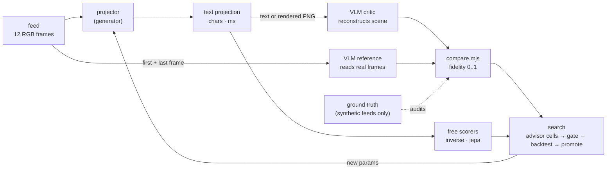

# Learning to project a feed into text

*Deep-dive. Written for two readers: a **newcomer** asking "can a machine judge whether character art shows what the camera saw?", and a **practitioner** who wants to add a projector, a scorer or an advisor to the plugin layer. Back to the [README](../README.md). The code is [`plugins/ml/`](../plugins/ml/) and its mark is [`plugins/ml/MARK.md`](../plugins/ml/MARK.md). Every number below comes from a run whose raw model replies are in [`plugins/ml/logs/`](../plugins/ml/logs/) and replay from [`plugins/ml/cache/`](../plugins/ml/cache/).*

**What is built and what is proposed.** Marked throughout as **[built]** (code in this branch, run, number measured), **[built, thin]** (runs, but the evidence is small: 4 scenes, one critic sample each) or **[proposed]** (described, not built).

## 1. In one breath

A projector turns a few seconds of camera frames into plain text. A vision-language model is then shown **only the text** and asked to reconstruct the scene as data: which objects, where, moving which way. A second reading of the **real frames** is the reference, and the agreement between the two readings is the projection's **fidelity**. The projector plays the generator and the vision model plays the critic, GAN-style, except that nothing is trained by gradient: a search proposes new projector settings and keeps the ones that score better per character and per millisecond.

## 2. Why it exists

Syzygy's kernel turns a frame into characters with the same bytes on every machine, and it deliberately *measures without judging*. Nothing in the kernel can tell you whether its characters show what the camera saw. Chiaroscuro, its predecessor, had a human-eye check for that, the **lake test**: put a new engine next to the honest brightness-only Mirror and look. That check doesn't scale, and it can't run inside a search loop.

This work makes the lake test a number, so that:

- two projectors can be compared on the same feed without a person looking;
- a projector's settings can be **searched** on the same three-way trade the rest of the fleet uses: fidelity (good), characters (cheap), compute (fast);
- "understanding a feed over time" gets an operational meaning. Motion is part of the scene description, and a projector that shows *what moved* can be rewarded for it.

## 3. The mental model



Four ideas carry the design:

1. **A scene description is the shared currency.** Critic, reference and ground truth all emit the same JSON: `setting`, and per object a `label`, a `category`, a 3×3 `region`, a normalized bounding `box` (a flat 2-D "wireframe") and a `moving` direction. `compare.mjs` pairs objects greedily and scores what matched, where it is and whether it moves the same way. It divides by the larger of the two object counts, so a critic that lists everything it can imagine is charged for it.
2. **Two references, reported side by side.** `vs_vlm` compares against a VLM's reading of the real frames. That is the mission's definition, and it works on a real camera with no labels. `vs_truth` compares against the generator's ground truth. That only works on synthetic feeds, but it **audits the critic itself**.
3. **Signals cost different amounts, so they cascade.** `inverse` is free and local: it reads the text back as ink and correlates that with brightness. `jepa` is cheap and local: a probe asks how well the text predicts the next frame. `vlm` is paid: one call per scene. A search spends the free ones first.
4. **The kernel measures, the plugins interpret.** The `syzygy` projector runs the shipped, byte-exact JS port unmodified. No plugin can change what the kernel emits, and the plugin selftest re-derives the golden `0x6dbdd1a8` from the very module the projector loads.

## 4. Walkthrough with real output

### 4.1 The feeds

There is no camera in a headless container, so [`scenes.mjs`](../plugins/ml/scenes.mjs) draws four 320×192 feeds of 12 frames each. Each has a background and 3–4 objects, one of them moving at a known velocity. Ground truth is rendered, not guessed: each object is drawn alone on a sentinel frame to get its exact box in the newest frame.

| feed | objects (truth) | moving |
|---|---|---|
| street | sun, house, tree, car | car → right |
| park | cloud, tree, person (stick figure) | person ← left |
| night | moon, two towers, car | car ← left |
| room | window, table, ball | ball → right |

### 4.2 The projectors, on the street feed (48 columns, 672 characters each)

**mirror** [built]: brightness only, ` .:-=+*#%@`. The lake-test reference.
```
************************************************
***************************************%%%%#****
**************************************#%%%%%#***
*********+-:=+*************************#####****
******+=::::::-=*******************+===+********
****+------------=****************-------+******
#####+++++++++##+*###############=--------######
#####+++++--=+%%**###############*-------+######
#####+++++..-++++*#################+=:=+*#######
+++++=====--=====+++++++++++++++++++=:=+++++++++
=================================-+**-==========
================================---------=======
================================-..-==: :=======
================================================
```

**syzygy** [built]: the fused kernel's per-cell glyph. Sobel edge glyphs on edges, the density ramp elsewhere. As the kernel ships it, `─`/`│` name the *gradient* axis (mark 0003), so the horizon reads `│││` and the frame's left border reads `─`:
```
─+++++++++++++++++++++++++++++++++++++++++++++++
─+++++++++++++++++++++++++++++++++++++╱╱###╲╲+++
─+++++++++++++++++++++++++++++++++++++─#####─+++
─++++++++╱╱│╲╲+++++++++++++++++++++++++╲╲#╱╱++++
─******╱╱:::::╲╲╲*******************││││********
─***╱╱:::::::::::╲╲***************╱:::::╲╲******
─****─========││╲─***************─:::::::──*****
─****─====│││=─│──***************╲╲::::::─╱*****
─****─====─.─====─*****************╲╲:╱╱╱*******
─│││││││││╲│╱│││││││││││││││││││││││╱──│││││││││
─================================─╱││╲╱=========
─===============================─:╲││::││─======
─===============================╲─ ─││─ ─╱======
─===============================================
```
With `orient: 'tangent'` [built] the plugin swaps only `─`↔`│`. The kernel's diagonals already lie along their edges, and the roof shows it. Now every glyph traces its edge: walls `│`, horizon `─`, the sun a ring. The kernel's bytes are untouched.

**syzygy, braille field** [built]: the kernel's 8-dot braille mask, one dot per pixel above threshold, so each character carries 2×4 pixels of shape.
```
⣿⣿⣿⣿⣿⣿⣿⣿⣿⠟⠋⠈⠙⢿⣿⣿⣿⣿⣿⣿⣿⣿⣿⣿⣿⣿⣿⣿⣿⣿⣿⣿⣿⣿⣿⣿⣿⣿⣿⣿⣿⣿⣿⣿⣿⣿⣿⣿
⣿⣿⣿⣿⣿⣿⡿⠋⠁⠀⠀⠀⠀⠀⠈⠻⢿⣿⣿⣿⣿⣿⣿⣿⣿⣿⣿⣿⣿⣿⣿⣿⣿⣿⣿⠿⠟⠛⠛⠿⣿⣿⣿⣿⣿⣿⣿⣿
⣿⣿⣿⣿⣟⣁⣀⣀⣀⣀⣀⣀⣀⣀⣀⣀⣀⣉⣻⣿⣿⣿⣿⣿⣿⣿⣿⣿⣿⣿⣿⣿⣿⡿⠁⠀⠀⠀⠀⠀⠈⢻⣿⣿⣿⣿⣿⣿
⣿⣿⣿⣿⣿⣿⣿⣿⣿⣿⣿⣿⣿⣿⣿⣿⣿⣿⣿⣿⣿⣿⣿⣿⣿⣿⣿⣿⣿⣿⣿⣿⣿⡇⠀⠀⠀⠀⠀⠀⠀⢸⣿⣿⣿⣿⣿⣿
⣿⣿⣿⣿⣿⣿⣿⣿⣿⣿⠛⠛⢻⣿⣿⣿⣿⣿⣿⣿⣿⣿⣿⣿⣿⣿⣿⣿⣿⣿⣿⣿⣿⣷⡀⠀⠀⠀⠀⠀⢀⣼⣿⣿⣿⣿⣿⣿
   … (rows 1–3 and 10–14 elided: solid ⣿)
```

**motion** [built]: the new projector, which shows *what moved*. Per cell it builds a temporal-median background over the last 12 frames, finds foreground blobs in the newest frame, and tracks them back through a 4-frame window by nearest centroid. It then redraws the scene with the blob's leading edge as direction arrows and a `~` trail where the blob just was:
```
… (rows 0–9 identical to mirror)
============================~~~~~~+*>-==========
==========================~~~~~~-------->=======
==========================~~~~~~~.>~~~: >=======
================================================
```
Its tracker reads the car at **+2.77 cells/frame → right**. On all four feeds the tracker's direction matches the truth (selftest). On a feed where nothing moves, its output equals the mirror's byte for byte, so motion costs nothing when nothing moves.

### 4.3 The ceiling: the critic reading the real frames

Before scoring any text, the critic (Qwen3-VL-30B-A3B via DeepInfra) is shown the real first and last frames and compared with ground truth. That is the most any projection can hope to recover:

```
$ node plugins/ml/playtest.mjs --stage ceiling
=== ceiling: Qwen/Qwen3-VL-30B-A3B-Instruct reads the real frames, vs ground truth ===
  street fidelity 0.989  motion_recall 1
  park   fidelity 0.935  motion_recall 1
  night  fidelity 0.920  motion_recall 1
  room   fidelity 0.833  motion_recall 0
  MEAN ceiling 0.919
```

Two lessons came from getting here. First, the ceiling was 0.745 until `compare.mjs` learned that Qwen-VL writes boxes on a 0–1000 grid in some replies and 0–1 in others. Second, with a 3-frame gap the critic said the person and the ball were *not* moving. It needed the full 11-frame gap to see it.

### 4.4 The lake test, in numbers

Same four feeds, 1216 characters each (64 columns), critic Qwen3-VL-30B. **Text mode** puts the characters in the prompt; **image mode** renders them to a PNG (light monospace on black, cells 2:1) in headless Chromium, so the critic *sees* them the way a person at a terminal would.

| projector | vlm fidelity, text | vlm fidelity, image | vs truth, image | motion recall, image | jepa R² | inverse (tone) | chars |
|---|---|---|---|---|---|---|---|
| mirror | 0.068 | 0.322 | 0.325 | 0.33 | 0.000 | 0.929 | 1216 |
| mirror ×2 frames | 0.219 | 0.214 | 0.195 | 0.00 | 0.087 | 0.929 | 2432 |
| syzygy (glyph) | **0.306** | 0.282 | 0.308 | 0.00 | 0.000 | 0.631 | 1216 |
| syzygy (braille) | — | **0.500** | 0.501 | 0.00 | 0.000 | 0.761 | 1216 |
| motion (tone bg) | 0.224 | 0.248 | 0.233 | 0.33 | **0.195** | 0.905 | 1216 |
| motion (fused bg) | — | 0.287 | 0.331 | 0.00 | 0.195 | 0.631 | 1216 |

(Text-mode motion recall: mirror 0.00, motion **0.50**. The same five text-mode candidates with the larger Qwen3-VL-235B critic: mirror 0.110, mirror×2 0.085, syzygy 0.179, motion 0.146, motion+legend **0.304**.)

What the numbers say, and how far to trust them:

- **Every projection loses most of the scene.** The best baseline recovers 0.50 against a 0.92 ceiling. The gap is shared between the projector and the critic's ability to read character art, and these runs can't split it.
- **How the critic reads changes the ranking.** Shown text tokens, the edge-glyph projection wins (0.306) and the honest mirror almost vanishes (0.068). Shown a *picture* of the same text, the mirror jumps to 0.322 and braille reaches 0.500. A projector is only "good" relative to a reader, so the critic mode belongs in the config, not in the fine print.
- **The free tonal score points the wrong way.** `inverse` ranks the mirror first and the edge glyphs last, the reverse of the critic. A search that used tone as its objective would optimize away the edges that make the scene legible. The free scorer is still useful as a sanity floor (a shuffled mirror scores < 0.11), not as an objective.
- **Motion shows up in the right places.** The motion projector is the only one with a nonzero JEPA score (0.195–0.27: the text predicts *where the next frame will change*) and the best text-mode motion recall (0.50). The critic still misses motion more often than it catches it.
- **Noise is large.** n = 4 scenes, one sample each. The same projector moves by ±0.15 between critic modes and models, and a one-line legend flipped a 235B score from 0.146 to 0.304. Treat single differences below ~0.1 as unresolved.

### 4.5 The JEPA-lite probe

[built, thin] For each projector config, a ridge probe is trained on 600 random synthetic feeds and tested on 150 others. It maps features of the text for frames 0..11 to a target computed from frame 12, which the projector never saw. No labels are involved: the feed supervises itself.

| target | mirror | mirror ×2 | syzygy | motion (tone) | motion (blank bg) |
|---|---|---|---|---|---|
| next-frame luma (16×8) | 0.983 | 0.983 | 0.973 | 0.930 | −2.37 |
| signed change (next − current) | ≤ 0.02 | ≤ 0.02 | ≤ 0.02 | < 0 | < 0 |
| **\|change\| — where it will change** | **−0.01** | **0.087** | **0.000** | **0.195** | **0.214** |

"Predict the next frame" is useless as a signal: every scene is mostly static, so any tone-preserving text scores about 0.98. The signed change can't be learned linearly, because a dark car on grass and a bright ball on a floor move the same way with deltas of opposite sign. *Where* the next change will happen is both learnable and discriminating. It is the one signal here that rewards understanding over time, and it costs no API call.

### 4.6 The evolving search

SEARCH_SECTION

### 4.7 The typed gate

[built] Every proposal passes `registry.validateParams` first. It is deterministic and free, and it names every fault (unknown key, wrong type, out of range, not in enum). Only a legal config reaches TypeSafe's Jev (`/v1/systemone`, a `noul` question: *"is this config legal and not self-defeating?"*). Jev was measured against 8 hand-labelled configs (`node plugins/ml/gatecheck.mjs`):

```
legal: mirror defaults             validator accept  jev noul 0.89  agrees
legal: syzygy braille 96 cols      validator accept  jev noul 0.72  agrees
legal: motion fused bg, unicode    validator accept  jev noul 0.88  agrees
legal: motion blank bg, fill       validator accept  jev noul 0.82  agrees
bad: cols 400 (max 160)            validator REJECT  jev noul 0.07  agrees
bad: enum field "sobel"            validator REJECT  jev noul 0.64  DISAGREES
bad: thresh as string              validator REJECT  jev noul 0.37  agrees
bad: negative window               validator REJECT  jev noul 0.29  agrees
jev gate agreement with labels: 7/8
```

Jev answers in about 150 ms and got 7 of 8 right. It passed an out-of-enum value at 0.64, so it cannot replace the schema check. That is why the schema check is authoritative and Jev only advises; its score is logged on every scored row. The place Jev could earn its keep is *semantic* incoherence that a schema can't express. That is proposed and not measured here.

## 5. The contract

```js
import { registerProjector, registerScorer, project, score } from './plugins/ml/index.mjs';

registerProjector({
  name: 'mine',
  about: 'one line',
  params: {                      // typed; the gate and the search read this
    cols:  { type: 'int',   min: 16, max: 160, default: 64 },
    style: { type: 'enum',  values: ['a', 'b'], default: 'a' },
    gain:  { type: 'float', min: 0, max: 2, default: 1 },
    flag:  { type: 'bool',  default: false },
  },
  project(seq, p) {              // seq.frames: RGB frames, newest last
    const text = '...';
    return { text_projection: text, char_budget: [...text.replace(/\n/g, '')].length,
             compute_estimate: { ops: 0 } };   // ms is measured by the registry
  },
});

registerScorer({ name: 'mine', cost: 'free' | 'cheap' | 'paid',
  async score({ seq, projection, truth, ctx }) { return { fidelity: 0.0, detail: {} }; } });
```

`project()` refuses a malformed config, times the call, and throws if `char_budget` doesn't match the characters actually returned. `score()` throws if fidelity falls outside [0, 1]. A breach of the contract is a plugin bug, never a low score.

**Receipts:**

```
$ node plugins/ml/selftest.mjs          # offline: SYZ_ML_OFFLINE=1 is set inside
=== plugins/ml self-test ===
  ok  : three projectors registered: mirror, syzygy, motion
  ok  : gate names all 5 faults in a malformed config (5)
  ok  : the port the syzygy projector loads hashes to golden 0x6dbdd1a8
  ok  : motion finds the right-moving object in street (blobs: right/34)
  ok  : still feed: motion projector == mirror, byte for byte
  ok  : hallucinating 4 extra objects is charged (0.575)
  ok  : inverse: mirror 0.888 vs shuffled 0.000 on street
  ok  : mutation cell: 1000 random mutations, 0 malformed configs
  ok  : SYZ_ML_OFFLINE=1 refuses an uncached paid call
  ...
plugins/ml selftest: SELFTEST_TOTAL
```

| file | role |
|---|---|
| `registry.mjs` | the contract, typed-params gate, `project()` / `score()` wrappers |
| `projectors/{mirror,syzygy,motion}.mjs` | the three projectors |
| `scorers/{inverse,vlm,jepa}.mjs` | free tone check, the VLM GAN-check, the JEPA-lite probe |
| `compare.mjs` | the discriminator arithmetic (pure) |
| `scenes.mjs` | synthetic feeds with rendered ground truth |
| `apis.mjs` | DeepInfra, DeepSeek, Kimi, ZAI, TypeSafe, MothQuantum; disk cache + call log |
| `render.mjs` | text → PNG (Chromium) for the image-mode critic |
| `search.mjs` | advisor cells, gate, cascade, Pareto front |
| `playtest.mjs` / `gatecheck.mjs` / `selftest.mjs` | the harnesses |

## 6. Failure modes (the scars)

- **The critic is the weakest link, and it varies.** Reading real frames it scores 0.92; reading the best text, 0.50. Its ranking flips between text and image input and between the 30B and 235B models. Every fidelity here is "fidelity *to this reader*".
- **n = 4.** Four drawn scenes, one sample per cell. A search can overfit these four. The next step is more feeds with repeated samples and intervals, not more generations.
- **Synthetic is not a camera.** Flat colours and hard edges favour edge glyphs and braille. A real feed has noise, soft light and a camera that moves, which breaks the median background.
- **The median background needs history.** With a 6-frame history the car covered its own path for more than half the frames and became background (found by playtest; fixed by giving the median 12 frames and tracking over 4). A live camera has seconds of history, but a panning one has none.
- **Kernel scar, surfaced not changed.** The kernel's `─`/`│` name the gradient axis, and Sobel zero-padding makes column 0 an edge (`─`) on every frame. Both are documented kernel behaviour (mark 0003 and a selftest check). The plugin offers `orient: 'tangent'` rather than touching the golden bytes.
- **Scene-description drift.** Qwen-VL mixes 0–1000 and 0–1 boxes and invents regions like `top-center`. `compare.mjs` normalizes boxes and falls back from region to box. A new critic model needs this checked again.
- **The tonal proxy is anti-aligned** with semantic fidelity (§4.4). Don't use it as an objective.
- **Braille costs 3 bytes.** `char_budget` counts code points. A braille or box-drawing character is 3 UTF-8 bytes against 1 for ASCII, so on a serial line braille's 0.500 costs 3× the bytes of mirror's 0.322.
- **"Quantum" here is a simulator.** The quantum cell draws from MothQuantum's `comet-qrng-v1` in `emu` mode, an Aer simulator that the API itself labels *uncertified*. It exercises the plumbing for un-gameable exploration; it is not a quantum-randomness claim. `mode: 'qpu'` is one argument away and was not spent.
- **Advisors can ask for impossible things.** LLM proposals that fail the gate are logged with reasons and never scored (§4.6).

## 7. How it composes

- **With the kernel:** the `syzygy` projector and the `motion` projector's `fused`/`braille` backgrounds call the byte-exact port, so their output is anchored to `0x6dbdd1a8`. A fidelity score on a kernel projection is a statement about the *kernel's* bytes, which any device can reproduce.
- **With the trust plane:** the seed puts verdicts outside Syzygy (the kernel fills only the *measured* field). A fidelity score is exactly such a verdict. It belongs to a verifier sitting on top, which is where this plugin layer sits.
- **With the mesh (0008):** a projection is small text. Several devices could each project the same view, and a critic could score the merged grid. [proposed]
- **With chiaroscuro's Director:** the Director reads scene motion and light and picks a look. The search here is an offline, measured version of that choice, and its Pareto front is a table a Director could consult at run time: when motion is high pick X, when static pick braille. [proposed]
- **With the fleet's System-2 pattern:** advisor cells propose, a gate rejects, a backtest scores, winners are promoted. This search is a System-2 for projections. The fleet's `labs/system2-backtest` and `labs/route-preference` are not in this repository, so the iron triangle here is re-implemented, not imported.

## 8. Where to look next — the whole landscape

| idea | status | what exists / what to do |
|---|---|---|
| frame-diff / tracked-blob motion glyphs | **[built]** `projectors/motion.mjs` | median background, blob tracking, arrows, trails, legend; add real optical flow (block matching per cell) for non-rigid motion |
| VLM reconstruction as GAN-check | **[built, thin]** `scorers/vlm.mjs` | text + image critic modes, two references; next: 3 samples per cell with intervals, more feeds, a real camera clip |
| VLM wireframe / 3-D sketch as auxiliary target | **[built, 2-D only]** | boxes are the 2-D wireframe; a depth-ordered layer list or a VLM-drawn SVG is **[proposed]** |
| LLM advisor proposing params | **[built]** `search.mjs` (DeepSeek, Kimi, ZAI) | see §4.6 for how each cell did |
| typed system-one gate (TypeSafe Jev) | **[built]**, measured 7/8 | advisory; next: ask it semantic questions the schema can't |
| JEPA-style next-frame predictor | **[built, thin]** linear probe, 16×8 \|Δ\| target | next: frozen image encoder target (CLIP via DeepInfra `clip-ViT-B-32`), a small MLP |
| quantum draws for exploration | **[built, emu]** `apis.quantumBytes` | a `qpu` run; compare with the xorshift control over many seeds |
| evolving advisor cells, backtest, promote | **[built, thin]** | 3 generations here; next: cell credit assignment (give more proposals to cells that win) |
| chiaroscuro shape-match election (4×6 Hamming) | **[proposed]** | a projector plugin; the contract needs nothing new |
| half-block colour projection | **[proposed]** | colour is out of the ASCII brief; `▀` with ANSI colour doubles vertical resolution |
| critic-side learning (a reader tuned to the projector) | **[proposed]** | a projector/reader pair is a code; the gap to 0.92 says the reader matters as much as the writer |
| Minimax video as synthetic feeds | **[proposed]**, not spent | cheap stills were enough to find the scars above; real motion (walking, turning) is the next reason to spend it |

Run it yourself:

```sh
node plugins/ml/selftest.mjs                              # contract, offline
SYZ_ML_OFFLINE=1 node plugins/ml/playtest.mjs --stage grid   # replays every critic call from cache
node plugins/ml/playtest.mjs --stage all                  # real calls for anything not cached
```
